## Bone and Joint Infections {background-color="#b20e10"}

<br>

<br>

<center>

**Russell E. Lewis** <br> Associate Professor of Infectious Diseases <br> Department of Molecular Medicine <br> University of Padua

<center>

::: {style="display: flex; justify-content: center; align-items: center; gap: 40px;"}
{width="400"}
:::

<br>  russelledward.lewis\@unipd.it <br>  [https://github.com/Russlewisbo](https://github.com/Russlewisbo/ESCMID_2022_talk) <br> Slides and course materials: [www.padovaid.com](https://padovaid.com/)

</center>

## Learning objectives

<br>

**By the end of this lecture, you will be able to:**

-   Diagnose septic arthritis, osteomyelitis, and prosthetic joint infection using clinical, laboratory, and imaging criteria
-   Interpret synovial fluid, bone biopsy, and molecular diagnostics appropriately
-   Select empirical and directed antimicrobial therapy based on patient risk factors and local epidemiology
-   Manage source control decisions (joint aspiration, debridement, prosthesis exchange)
-   Apply evidence from key trials (OVIVA, Gjika, Zimmerli) to clinical practice

::: notes
These five learning objectives anchor the entire session. You should be comfortable with diagnosis first—missing septic arthritis or osteomyelitis is costly. Then antimicrobial selection, which depends on both the organism and the site (native joint, bone, implant). Finally, source control and surgical decision-making, which separates good outcomes from poor ones. We'll reference evidence-based trials throughout.
:::

## Taxonomy of bone and joint infections

<br>

-   **Native joint infection**

    -   Acute bacterial arthritis (septic arthritis)

    -   Gonococcal and non-gonococcal arthritis

-   **Bone infection**

    -   Acute hematogenous osteomyelitis

    -   Chronic osteomyelitis (contiguous, vascular insufficiency)

    -   Vertebral osteomyelitis

-   **Prosthetic implant infection**

    -   Early, acute hematogenous, chronic prosthetic joint infection

::: aside
This taxonomy reflects the Waldvogel and Cierny-Mader classifications you'll see throughout. The key distinction is the site (joint vs bone vs implant) and timing (acute vs chronic). Each has different epidemiology, organisms, and management strategies. We'll go through each in depth.
:::

# Septic arthritis {background-color="#b20e10"}

## Epidemiology of septic arthritis

<br>

-   **Incidence:** 2-10 per 100,000 population annually
-   **Trend:** Rising incidence, particularly in older adults and IVDU populations
-   **Mortality:** 5-15% overall; 30-50% in bacteremic septic arthritis
-   **Morbidity:** 25-50% of survivors have permanent joint dysfunction
-   **Risk:** Mortality increases with age \>65 years, comorbidities, delayed diagnosis

::: aside
The incidence varies by population studied and region. In developed countries, opioid-driven IVDU has significantly increased rates of unusual sites like sternoclavicular and pubic joints. Mortality remains substantial even with modern care, emphasizing the need for rapid diagnosis and appropriate therapy. Permanent joint damage is common even in treated cases, underscoring that this is truly a medical emergency. [@Kaandorp1995; @Rutherford2016; @Abram2020]
:::

## Risk factors for septic arthritis

<br>

| Risk Factor                   | Mechanism                              |
|-------------------------------|----------------------------------------|
| Rheumatoid arthritis          | Joint inflammation, immunosuppression  |
| Age \>80 years                | Comorbidities, delayed diagnosis       |
| Diabetes mellitus             | Impaired immunity, frequent procedures |
| Prosthesis/recent surgery     | Direct inoculation, foreign body       |
| IVDU                          | Bacteremia, unusual sites              |
| Immunosuppression (HIV, TNFi) | Atypical organisms, fulminant course   |
| Corticosteroid therapy        | Impaired phagocytosis                  |

::: aside
Risk factors cluster into two groups: those that predispose to bacteremia (IVDU, DM, immunosuppression) and those affecting local joint defenses (RA, age, prior joint disease). Some patients have multiple risk factors, raising suspicion significantly. The presence of any one of these should lower the diagnostic threshold for septic arthritis. However, septic arthritis can occur even without obvious risk factors—don't anchor on "this patient is too healthy."
:::

# Part I: Native Joint Septic Arthritis {background-color="#b20e10"}

## Microbiology overview: Causative organisms

<br>

::::: columns
::: {.column width="50%"}
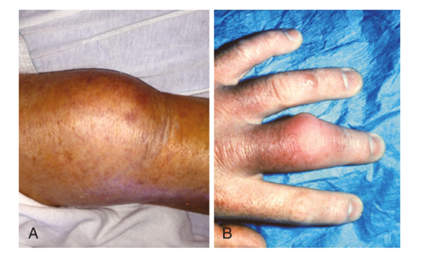
:::

::: {.column width="50%"}
-   **Staphylococcus aureus:** 40-70% of cases (increasing)
-   **Streptococci (Groups A, B, G):** 15-20%
-   **Gram-negative rods (E. coli, Klebsiella, Pseudomonas):** 5-25%
-   **Coagulase-negative staphylococci:** \<5% (native joint)
-   **Anaerobes:** Rare in native joint (\<3%)
-   **Fastidious organisms:** N. gonorrhoeae, Haemophilus influenzae, Brucelleosis
:::
:::::

::: aside
*S. aureus* dominates and its prevalence is increasing, driven by IVDU and community-acquired MRSA. Young, sexually active patients should raise suspicion for *N. gonorrhoeae*—it's the most common cause in that demographic. Gram-negative organisms are overrepresented in IVDU and elderly patients. The organisms matter because they guide empirical therapy. Always think about Gram stain results to narrow the differential within minutes of aspiration.
:::

## Microbiology by patient category

<br>

| Category | Typical organisms |
|----|----|
| **Community-acquired, low risk** | S. aureus (MSSA), streptococci |
| **IVDU/Needle users** | S. aureus (MRSA \>\>), Pseudomonas, Gram-negatives |
| **Diabetes mellitus** | Group B Streptococcus, S. aureus |
| **Animal bite (Pasteurella multocida)** | Pasteurella, Staph, anaerobes |
| **Human bite (Eikenella corrodens)** | Eikenella, Staph, anaerobes, Strep |
| **Sexually active (age 15-40)** | *Neisseria gonorrhoeae* \>\> others |

::: aside
These associations are critical for empirical therapy before culture results. A 32-year-old with acute monoarticular arthritis and no clear risk factors? Think gonorrhea. A 45-year-old with diabetes and knee arthritis? Add GBS to your empirical coverage. A patient with recent animal scratch and finger joint swelling? Pasteurella is likely. These clinical epidemiologic links are how you optimize initial therapy.
:::

## MRSA septic arthritis: Emerging problem

<br>

::::: columns
::: {.column width="50%"}
{fig-align="center"}
:::

::: {.column width="50%"}
-   **MRSA prevalence in septic arthritis:** 18-40% in IVDU populations; 15-25% overall in developed countries
-   **Community-acquired MRSA:** USA300 strain predominates; more virulent (PVL toxin)
-   **Clinical features:** No different from MSSA; may have higher recurrence rates
-   **Prognosis:** Mortality similar to MSSA; more frequent treatment failures reported
-   **Implications:** Empirical vancomycin or daptomycin required if MRSA risk present
:::
:::::

<br>

::: aside
The emergence of CA-MRSA with PVL toxin has changed the landscape. This means empirical vancomycin coverage is now standard in many settings, even for outpatient-acquired septic arthritis. The toxin may explain higher recurrence rates. Always de-escalate from vancomycin to nafcillin if MSSA is confirmed; vancomycin is inferior for MSSA infections.
:::

## Routes of infection in joint infections

<br>

-   **Hematogenous (Most common)**

    -   Transient bacteremia from skin, GI, GU, or respiratory source

    -   Occurs in \~85% of cases

    -   S. aureus, streptococci most common

-   **Direct inoculation**

    -   Arthrocentesis, surgery, bite/laceration over joint

    -   IVDU with joint site injection

    -   Gram-negatives, S. aureus

-   **Contiguous spread**

    -   Adjacent bone or soft tissue infection extending to joint

    -   Osteomyelitis → septic arthritis

    -   Often polymicrobial

::: aside
Hematogenous seeding is most common, which is why blood cultures matter—positive in \~50% of cases. Direct inoculation now includes IVDU with direct joint injection, which has increased in incidence. Contiguous spread used to be more common historically; now it's less frequent but still important in diabetic patients and those with complex fractures.
:::

## Joint aspiration

<br>

{fig-align="center"}

## Pathophysiology: Joint destruction timeline

<br>

| Timeline | Mechanism | Histology |
|----|----|----|
| **0-48 hours** | Bacterial multiplication, neutrophil influx, synovial inflammation | Purulent synovitis |
| **48-72 hours** | Proteolytic enzyme release (collagenase, hyaluronidase), cartilage surface erosion begins | Cartilage erosion, fibrin deposition |
| **\>5-7 days** | Deep cartilage invasion, subchondral bone erosion, potential ankylosis | Advanced necrosis |

<br>

***S. aureus*** **virulence**

-   Protein A, coagulase inhibit opsonophagocytosis

-   α-toxin causes direct cellular damage

-   Biofilm formation (intracellular sequestration)

::: notes
This timeline is why *rapid* joint aspiration and drainage matter. If you can aspirate at 24-48 hours, you may prevent permanent cartilage loss. By 5-7 days, structural damage is often irreversible. <br> *S. aureus* is particularly destructive due to its toxin arsenal and ability to evade the immune system. Even with therapy, permanent disability occurs in 25-50% of cases, which reflects the destructive power of these pathogens.
:::

## Clinical presentation: Acute septic arthritis

<br>

**Classic tetrad (80-90% of cases)**

-   Acute monoarticular arthritis (sudden onset) - Pain, swelling, warmth, erythema

-   Restricted range of motion (pain-limited)

-   Fever (present in 70-90%)

**Atypical presentations**

-   Polyarticular arthritis (10-20%, worse prognosis)

-   Subacute course (weeks, especially gonococcal)

-   Low-grade fever or afebrile in immunocompromised

-   Minimal systemic toxicity (elderly, immunosuppressed)

::: aside
The classic "hot joint" with fever is only present in about 70% of cases. Don't be falsely reassured by absence of fever—elderly and immunocompromised patients may present with subtle findings. Polyarticular arthritis is uncommon but important to recognize; it usually indicates \*S. aureus \* bacteremia with seeding of multiple joints. Always examine multiple joints systematically, especially in febrile patients with arthralgia.
:::

## Joint distribution and frequency

<br>

-   **Knee:** 50% of cases (large, superficial, mobile)
-   **Hip:** 20% of cases (deeper, higher mortality if delayed)
-   **Shoulder:** 10%
-   **Ankle/foot:** 5-10%
-   **Wrist:** 3-5%
-   **Other:** Sternoclavicular, sacroiliac (especially IVDU)

**IVDU Exception**

-   Sternoclavicular and sacroiliac joints more common

-   Unusual sites reflect direct injection at those sites

-   *S. aureus* and *Pseudomonas* predominate

::: aside
The knee dominates because it's large and mobile. Hip infection is more serious because it's deeper and diagnosis may be delayed. In IVDU, think beyond the usual joints—sternoclavicular and SI joint infections are increasingly recognized and can be subtle (fever, shoulder/back pain without obvious joint swelling). <br>Hip infections in children and some adults can have high mortality from delayed diagnosis.
:::

## Polyarticular septic arthritis

<br>

**Definition:** ≥2 joints involved simultaneously

**Frequency:** 10-20% of septic arthritis cases

**Associated risk factors**

-   *S. aureus* bacteremia (most common organism in polyarticular disease)

-   Rheumatoid arthritis on TNF inhibitors

-   Immunocompromised patients (HIV, post-transplant)

-   Disseminated gonococcal infection (DGI)

**Prognosis:** Worse than monoarticular; requires careful assessment of all joints

::: aside
Polyarticular septic arthritis is often missed initially if the clinician focuses on one painful joint. A patient with RA presenting with acute knee pain might not have an RA flare—systematically examine hips, shoulders, wrists, elbows. S. aureus bacteremia can seed multiple joints, and each one needs drainage. DGI classically presents with polyarthritis. The presence of polyarticular involvement should increase suspicion for bacteremia and drive blood culture collection.
:::

## Diagnostic approach: Systematic workup {.smaller}

<br>

-   **Step 1: Clinical Suspicion**

    -   Acute monoarticular or polyarticular arthritis + fever = septic arthritis until proven otherwise

-   **Step 2: Joint Aspiration (Same Day)**

    -   Urgent procedure if septic arthritis suspected

    -   Send fluid for: cell count, Gram stain, culture, glucose, LDH, protein

    -   Molecular testing if available

-   **Step 3: Blood Cultures**

    -   Before antibiotics

    -   Positive in 50-60% of cases; guides therapy

-   **Step 4: Imaging**

    -   X-ray (baseline, assess for bone involvement)

    -   MRI if imaging delays diagnosis or if deep joint (hip)

-   **Step 5: Start Empirical Therapy**

    -   Do NOT wait for culture results

    -   Base on Gram stain if available; otherwise broad coverage

<br>

::: aside
Joint aspiration is both diagnostic and therapeutic—don't delay it for imaging unless deep anatomy (hip) requires ultrasound guidance. Gram stain results within minutes drive empirical therapy choices. Blood cultures take 24-48 hours but are essential for confirmation and potentially changing therapy. Don't assume negative cultures mean no infection; 10-20% of cases are culture-negative despite synovial fluid showing sepsis.
:::

## Laboratory findings: Peripheral blood

<br>

| Parameter | Typical finding |
|----|----|
| WBC | Often elevated (\>12,000) but can be normal; higher in S. aureus |
| ESR | Elevated \>90 mmHg in septic arthritis; rises within 24-48 hours |
| CRP | Elevated 10-15 mg/dL; more sensitive than ESR in early infection |
| Procalcitonin | Marked elevation (\>2 ng/mL) suggests bacteremia |
| Blood cultures | Positive in 50-60% |
| Lactate | Elevated if bacteremic/septic state |

::: aside
Peripheral markers are nonspecific but support the diagnosis. A normal WBC doesn't exclude septic arthritis—up to 30% have WBC \<12,000. ESR is slow to rise, so absence in first 24 hours doesn't exclude disease. CRP is more sensitive early. Procalcitonin is high in septic arthritis (not just inflammation from RA or crystal disease), making it useful for differentiation. Positive blood culture changes management—indicates Staph aureus bacteremia with likely endocarditis risk, requiring echo and longer therapy consideration.
:::

## Synovial fluid characterization: The key test

<br>

| Parameter | Normal | Inflammatory | Septic | Hemorrhagic |
|----|----|----|----|----|
| **WBC (cells/μL)** | \<200 | 2,000-50,000 | \>50,000 | RBC-filled |
| **PMN %** | \<50% | 50-70% | \>90% | Variable |
| **Glucose** | Equal to serum | 50-150 mg/dL | \<25 mg/dL (often) | Variable |
| **Protein** | \<2 g/dL | 2-4 g/dL | \>4 g/dL | Variable |
| **Gram stain +** | Negative | Negative | 50-90% | Negative |
| **Culture +** | Negative | Negative | 80-90% | Negative |

::: aside
Septic fluid is inflammatory (high WBC, high PMN percentage) with very high protein and low glucose. The low glucose is thought to result from bacterial consumption and impaired glucose transport into inflamed synovium. Gram stain positivity in 50-90% is excellent—if you see cocci or rods, empirical therapy is clear. Culture positivity 80-90% means 10-20% are culture-negative; never rely on culture alone. Note: crystal arthritis can coexist with infection (you can have gout AND septic arthritis), so don't exclude septic arthritis based on crystal findings.
:::

## Synovial fluid WBC thresholds for diagnosis

<br>

**JAMA 2007 (2302 cases)** [@Margaretten2007]

| WBC Count          | Sensitivity | Specificity | Notes                        |
|--------------------|-------------|-------------|------------------------------|
| \>50,000           | 62%         | 92%         | High spec, misses \~40%      |
| \>25,000           | 77%         | 73%         | Better sensitivity           |
| PMN \>90%          | 73%         | 79%         | Complements WBC count        |
| Glucose \<25 mg/dL | 61%         | 98%         | Highly specific when present |
| Culture positive   | —           | 100%        | Gold standard (but slow)     |

<br> <br>

**Clinical Implication:** No single threshold rules in or out septic arthritis; use multiparameter assessment

::: aside
This landmark study is cited widely because it demolishes the myth of a single diagnostic cutoff. A WBC of 40,000 with 95% PMN and low glucose is septic arthritis until proven otherwise. A WBC of 2,000 doesn't exclude it. The diagnosis is probabilistic: combine WBC count, PMN percentage, glucose, Gram stain, and clinical context. Early disease (\<24 hours) may have lower WBC counts. Immunocompromised patients may not mount high WBC responses. That's why Gram stain and culture remain critical—they're specific even if WBC is modest
:::

## Microbiologic diagnosis: Culture methods {.smaller}

-   **Conventional culture (Gold standard)**

    -   Sensitivity 80-90% in non-pretreated cases

    -   Hold 14 days for fastidious organisms

    -   Requires adequate specimen volume (\>1 mL ideally)

    -   Slow (48-72 hours to identification and susceptibility)

-   **Blood Cultures**

    -   Positive in 50-60% of cases

    -   Send 2-3 sets before antibiotics

    -   Enables organism identification even if joint culture negative

    -   May grow same organism as joint (confirms diagnosis)

-   **Culture-negative cases (10-20%)**

    -   Prior antibiotic therapy (most common)

    -   Fastidious organisms (Brucella, Coxiella, Mycobacteria)

    -   Fungi, viruses

    -   Technical issues (inadequate inoculum, processing)

::: aside
Culture remains the gold standard because it allows organism identification and susceptibility testing. However, 10-20% of septic arthritis cases are culture-negative despite clinical and synovial fluid evidence of infection. This is increasingly recognized and drives the use of molecular methods. Never withhold therapy based on negative cultures if clinical picture is convincing. Always inoculate blood culture bottles (or holding medium like thioglycollate) if joint culture bottles are unavailable—this increases yield substantially.
:::

## Molecular diagnostics: PCR and beyond {.smaller}

<br>

**16S rDNA PCR**

-   Universal bacterial primers

-   Detects fastidious and unculturable organisms

-   Sensitivity 80-95% in some studies

-   Turnaround time 24-48 hours

**Multiplex PCR Panels**

-   Simultaneously identify common organisms

-   BioFire, Cobas, other platforms available in many centers

-   Turnaround time 1-2 hours - Cost higher but speeds diagnosis

**Metagenomic Next-Generation Sequencing (mNGS)**

-   Culture-independent, organism-agnostic

-   Identifies unexpected organisms

-   Increasing availability; still expensive

-   Role in culture-negative cases growing

-   **Current Status:** Not standard of care; reserve for culture-negative cases or unusual presentations

::: aside
Cost and turnaround time are barriers. However, they're increasingly used in research and in complex cases. A 35-year-old with septic arthritis that's culture-negative despite appropriate workup? Molecular testing is reasonable. A patient with Brucella exposure or TB risk? PCR can identify organisms conventional culture might miss.
:::

## Imaging in septic arthritis {.smaller}

::::: columns
::: {.column width="50%"}
**X-ray**: First-line imaging

-   Early findings: soft tissue swelling, capsular distension

-   Late findings: cartilage loss, bone erosions, subluxation

-   Lag time: damage visible 10-14 days into infection - Use: Baseline assessment, assess for fracture or dislocation

**MRI**: Gold standard for soft tissue and cartilage assessment

-   Sensitivity 82-100%, specificity 75-96%

-   Can assess synovial inflammation, extent of damage

-   Use: Hip infections (confirm diagnosis, guide aspiration), depth assessment

**Ultrasound**: Real-time guidance for aspiration

-   Identify effusion (sensitivity \>90%)

-   Used for hip, shoulder guidance

-   Avoids radiation, improves aspiration success
:::

::: {.column width="50%"}
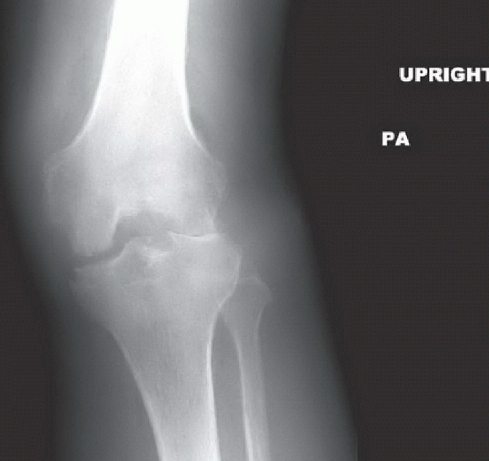{width="350"}
:::
:::::

::: aside
X-rays often appear normal early, which can falsely reassure. Don't exclude septic arthritis based on normal X-rays in the first 48-72 hours. MRI is excellent if you need to confirm a hip infection or assess damage extent, but it shouldn't delay aspiration. US-guided aspiration increases first-tap success, especially in hips and shoulders. Avoid delays in aspiration waiting for imaging; if clinical suspicion is high and joint is accessible, aspirate. Imaging guides the extent of damage and helps explain prognosis, not diagnosis.
:::

## Clinical case {.smaller}

::::: columns
::: {.column width="50%"}
<br> <br>

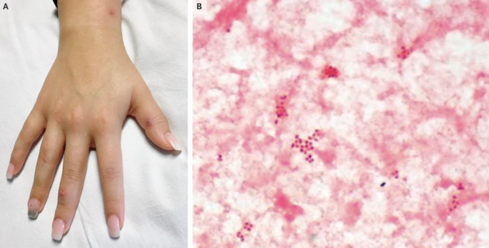
:::

::: {.column width="50%"}
A 20-year-old woman presented to the emergency department with a rash involving the arms, legs, trunk, and scalp, which had erupted that morning. <br> <br> She also reported generalized muscle aches, fever, and pain in both ankles. Two weeks earlier, the patient had had vaginal intercourse with a new partner without barrier protection.

<br> The physical examination was notable for erythematous pustules near the wrist and on the fingers (Panel A) and on the trunk, scalp, and both ankles. There was mild swelling and pain with passive motion in the right ankle and tenosynovitis involving the tendons of both ankles. Given a high suspicion for disseminated gonococcal infection, treatment with ceftriaxone and azithromycin was initiated. <br> <br> Blood cultures grew gram negative diplococci (Panel B) that were identified as *Neisseria gonorrhoeae*, which confirmed the diagnosis. The patient’s symptoms abated with antibiotic treatment. At 3 months of follow-up, the patient was feeling well, with no recurrence of skin lesions or joint pain
:::
:::::

::: aside
[@florez-pollack2019]
:::

## Gonococcal arthritis: <br> Disseminated gonococcal infection (DGI)

<br>

**Epidemiology**

-   Most common cause of septic arthritis in sexually active adults (age 15-40)

-   Occurs in 1-3% of untreated urogenital gonorrhea

-   Female predominance (2-3:1)

-   Often acquired from asymptomatic partners

**Classic Triad of DGI**

1.  Polyarthralgia/arthritis (knees, wrists, ankles)

2.  Skin lesions (pustules, macules on extremities)

3.  Tenosynovitis (wrist, ankle tendons)

<br> <br>

::: aside
DGI should be in the differential for any young patient with polyarticular arthritis and rash. The organism is sensitive to antibiotics, so outcomes are generally good if treatment is prompt. The challenge is diagnosis—gonococcal cultures are fastidious and often negative. Blood cultures positive in \~40%, joint cultures positive in \~10-50% depending on culture media. That's why NAATs are essential.
:::

## Gonococcal arthritis: Diagnosis and treatment {.smaller}

<br>

**Diagnosis**

-   Culture negative in \>50% of cases

-   NAATs (nucleic acid amplification tests) essential—test urogenital, rectal, pharyngeal

-   Gram stain of joint fluid rarely positive

-   High clinical suspicion critical (sexual history, rash, polyarthritis)

**Therapy**: **Ceftriaxone 500 mg to 1 g IV/IM once daily × 7-10 days**

-   Alternative (allergy): Spectinomycin, fluoroquinolone (if susceptible)

-   Excellent joint penetration

-   Early therapy prevents progression to chronic arthritis

**Partner Management**

-   Screen and treat sexual partners

-   Test for chlamydia co-infection (25-40%)

<br> <br>

::: aside
Empirical ceftriaxone for gonococcal arthritis is reasonable if NAAT pending or clinical suspicion high. Resistance to older agents (penicillin, tetracycline, fluoroquinolones) is rising globally, so ceftriaxone is now first-line. Unlike most septic arthritis, gonococcal arthritis usually doesn't require repeated joint aspiration—antibiotics alone are often sufficient. Outcomes are excellent with prompt treatment, making this one of the better-prognosis septic arthritis types.
:::

## Septic arthritis in IVDU: Emerging epidemiology {.smaller}

<br>

**Epidemiologic Shift**

-   IVDU now the most common risk factor for septic arthritis in many developed countries

-   Accounts for 30-60% of adult septic arthritis in urban centers

-   Often unrecognized due to atypical joint involvement

**Unusual Joint Sites in IVDU**

-   Sternoclavicular joint

-   Sacroiliac joint

-   Manubriosternal joint

-   Acromioclavicular joint

**Microbiology**

-   S. aureus predominates (\>70%), especially MRSA

-   Pseudomonas aeruginosa (25-40%), gram-negatives (E. coli, Klebsiella)

-   Polymicrobial in 15-25%

<br> <br>

::: aside
Some IVDU patients inject into joints directly. Sternoclavicular and SI joint infections can present subtly (fever, shoulder/back pain) without obvious joint swelling, so imaging and high clinical suspicion are essential. MRSA predominance means empirical vancomycin (or daptomycin) + Pseudomonas coverage (piperacillin-tazobactam, cephalosporin, fluoroquinolone) initially.
:::

## Septic arthritis in immunocompromised patients {.smaller}

<br>

-   **HIV/AIDS (CD4 \<200)**

    -   Higher incidence septic arthritis

    -   Similar organisms to immunocompetent (S. aureus predominates) but can have atypical organisms (MAC, mycobacteria, fungi)

    -   ART initiation improves immune response; may paradoxically flare with IRIS

-   **TNF Inhibitor therapy**

    -   Increased risk, especially infliximab \>etanercept

    -   *S. aureus* common; atypical organisms (TB, fungi) possible

    -   Consider TB risk before starting TNFi

-   **Post-Transplant**

    -   Bacteria common early; fungi/viruses/atypical later

    -   Higher mortality

-   **Clinical Implications**

    -   Don't assume atypical organisms without evidence. *S. aureus* remains most common even in AIDS

    -   Culture and molecular testing critical for organism identification

<br> <br>

::: aside
The key clinical point is that immunocompromised patients can still have S. aureus septic arthritis, which is the most common cause. However, you need to maintain a broader differential and be more aggressive with diagnostics. Fungi (Candida, Coccidioides, Histoplasma) can cause joint infections in immunocompromised patients. Mycobacterial infections (including TB) can present as monoarticular arthritis with chronic course. Always obtain adequate microbiologic specimens in these patients.
:::

## Management Principles: Source control + antimicrobials

<br>

::::: columns
::: {.column width="50%"}
**Source Control Is Essential**

-   Repeated joint aspiration or arthroscopic drainage

    -   Removes bacterial burden, inflammatory mediators, and pus

    -   Reduces time to sterilization

    -   Relieves pain, restores function

**Antimicrobial Therapy**

-   Empirical (broad) → Directed (organism-specific)

    -   IV access required initially

    -   High-dose regimens to maximize joint penetration

    -   Duration: typically 2-4 weeks (evidence evolving)
:::

::: {.column width="50%"}
**Outcome Determinants**

-   Time to diagnosis (\<1 week ideal)

-   Joint involvement (hip worse than knee)

-   Organism virulence (S. aureus \> streptococci)

-   Adequacy of source control

-   Comorbidities and immunity
:::
:::::

::: aside
The old dogma was "antibiotics alone are insufficient"—surgical drainage was always required. Modern data suggest that for some patients (especially streptococci with high-dose IV penicillin and aspiration), medical management alone can work. However, if initial aspiration shows frank pus, limited improvement after first aspiration, or hip involvement, you need arthroscopy or arthrotomy. The combination of adequate source control + appropriate antimicrobials is what matters.
:::

## Joint Drainage: Aspiration vs. arthroscopy vs. arthrotomy

<br>

| Approach | Indications | Advantages | Disadvantages |
|----|----|----|----|
| **Needle Aspiration** | Accessible joints, good cooperation | Simple, repeatable, low morbidity | May miss loculated pus |
| **Arthroscopy** | Large joint, difficult access, poor response | Excellent visualization, thorough debridement, can repeat | Operator-dependent, requires anesthesia |
| **Arthrotomy** | Hip, deep joints, debris/fibrin | Definitive source control, visualization | Most invasive, highest morbidity |

<br> <br>

**Evidence:** No RCTs comparing these approaches; practice varies widely

::: aside
Clinical judgment is paramount. A knee with acute monoarticular arthritis and positive Gram stain? Needle aspiration × 1-2, then antibiotics. If the patient doesn't improve clinically after 48 hours of IV antibiotics and repeat aspiration shows persistent pus, consider arthroscopy. Hip infections? Consider early arthroscopy given deeper anatomy and risk of femoral head necrosis. Repeat aspirations are reasonable—they're diagnostic (culture, susceptibility) and therapeutic.
:::

## Empirical therapy by gram stain result

<br>

| Gram Stain | Likely Organisms | Empirical Therapy |
|----|----|----|
| **Gram-positive cocci (chains/clusters)** | S. aureus, streptococci, enterococci | Vancomycin (or daptomycin) |
| **Gram-negative cocci** | N. gonorrhoeae (intracellular diplococcus) | Ceftriaxone |
| **Gram-negative rods** | E. coli, Klebsiella, Pseudomonas, others | Cefepime or meropenem |
| **Negative** <br> (or inadequate gram stain) | Broad differential | Combination: vancomycin + cephalosporin (3rd/4th gen) |

<br> <br>

**Key Point:** Gram stain directs therapy; don't wait for culture if Gram stain positive

::: aside
If the Gram stain shows gram-negative rods in a patient with risk factors for enteric organisms (DM, elderly, urinary source), add Pseudomonas coverage. If it shows gram-positive cocci and the patient is IVDU, think S. aureus and cover for MRSA until susceptibilities. If the Gram stain is negative or scanty, you must empirically cover S. aureus (vancomycin) and gram-negatives (3rd/4th generation cephalosporin) until culture results.
:::

## Directed therapy: MSSA (Methicillin-susceptible *S. aureus*)

<br>

1.  **Cefazolin 2 g IV q8h** (maximum 6 g/day)

    -   Alternative if mild beta-lactam allergy
    -   Good joint penetration
    -   Lower cost, less nephrotoxicity vs. anti-staphylococcal PCNs

2.  **Nafcillin 2 g IV q4h** or **Oxacillin 2 g IV q4h** (maximum 12 g/day)

    -   Excellent bone/joint penetration
    -   First-line for MSSA
    -   Allergy risk: cross-reactivity 1-2%, recent data suggesting higher rates of nephrotoxicity vs. cefazolin

3.  **Ceftriaxone 2 g IV q12h**

    -   Alternative; slightly less optimal than nafcillin for staph
    -   Use if concern for other gram-negatives

**Duration:** 3-4 weeks IV, or IV→oral switch after clinical improvement

<br> <br>

::: aside
Cefazolin is now preferred over antistaphylococal PCNs. Nafcillin and oxacillin are superior to cephalosporins for MSSA because of better bacterial killing and lower resistance rates. If the patient is allergic to beta-lactams, cephalosporins (especially cefazolin) are preferred over vancomycin because of lower MICs. Vancomycin is inferior for MSSA—don't use it unless true IgE-mediated allergy. Fluoroquinolone monotherapy (like levofloxacin) is inferior and not recommended. Duration is traditionally 3-4 weeks, though shorter courses (2 weeks) are being studied (see Gjika trial below).
:::

## Directed therapy: MRSA (Methicillin-resistant *S. aureus*)

1.  **Daptomycin**

    -   Dose: 10 mg/kg IV daily
    -   Superior bactericidal activity vs. vancomycin in animal models
    -   Excellent intracellular penetration
    -   Emerging preference in some centers

2.  **Vancomycin** (alternative)

    -   Dose: 15-20 mg/kg IV q8-12h (target AUC/MIC 400-600- old recommendation trough 12-20 μg/mL)

    -   Joint penetration \~50% of serum

    -   Nephrotoxicity, risk with higher exposures

3.  **Linezolid** (backup)

    -   Dose: 600 mg IV/PO q12h
    -   Good joint penetration, oral available
    -   Bone marrow toxicity with prolonged use (\>2 weeks)- Higher rates of thrombocytopenia when Cmin \> \~8; target: 2–7 mg/L
    -   Theoretical serotonin syndrome risk with concurrent serotonergic drugs (less than 0.5%) [@bai2022]

**Duration:** 3-4 weeks IV; consider oral switch to doxycycline + rifampin or linezolid after clinical improvement

## Emerging agents for septic arthritis

<br>

**Long-Acting Lipopeptides**

-   **Dalbavancin:** Every 7-day dosing (1500 mg × 2 doses)

-   Clinical data limited but growing (See DOTS trial) [@turner2025a]

-   Excellent MRSA coverage

-   Investigational for prosthetic infections

-   **Oritavancin:** Single 1200 mg IV dose

    -   Limited data in joint infections
    -   Not yet standard of care

-   **Ceftaroline:** 600 mg IV q12h

    -   MRSA-active , Limited clinical data in septic arthritis

    -   May be useful for empirical therapy if concern for both MSSA and MRSA

**Current Status:** Daptomycin and remain standard; emerging agents may expand options

::: aside
Dalbavancin is interesting because less frequent dosing may improve adherence, but clinical outcome data in septic arthritis are sparse. Don't use these agents empirically—stick with daptomycin or vancomycin for proven outcomes. Ceftaroline offers a bridge between MSSA agents and MRSA coverage; consider in empirical regimens if MRSA risk is high but not certain.
:::

## DOTS trial

::::: columns
::: {.column width="50%"}
-   **Noninferior efficacy**

```         
-    Comparable safety

-    Major logistical advantage (no long-term IV access)

-    Patients where **OPAT is difficult or unsafe**

-    IVDU, poor access, adherence concerns
```

-   Situations where avoiding central lines is valuable

Important nuance:

-   Trial population was **selected (post-clearance, lower-risk)** → limits generalizability to:

```         
-    Persistent bacteremia

-    Left-sided endocarditis

-    Deep uncontrolled foci
```
:::

::: {.column width="50%"}
{fig-align="center"}
:::
:::::

::: aside
[@turner2025a]
:::

## Dalbavancin TDM

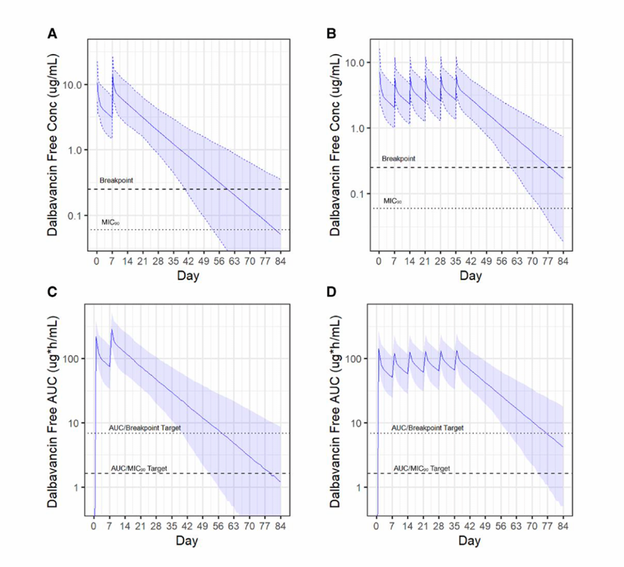{fig-align="center"}

::: aside
[@volk2024]
:::

## Duration of septic arthritis therapy: Evolving evidence {.smaller}

<br>

**Traditional Dogma:** 3-4 weeks IV antibiotics

-   **RCT, streptococcal arthritis** [@Gjika2019a]

    -   2 weeks IV therapy non-inferior to 4 weeks

    -   Primary endpoint: clinical cure at 24 weeks

        -   2-week group: 80% cure vs. 4-week: 82%

        -   Post-hoc analysis: *S. aureus* may need longer therapy

-   **Practical Implications**: Streptococcal septic arthritis: 2 weeks reasonable

    -   *S. aureus*: traditional 3-4 weeks prudent pending further evidence

    -   Oral switch: consider after clinical improvement if MSSA (fluoroquinolone + rifampin) or MRSA (linezolid, doxycycline + rifampin)

-   **Factors favoring longer duration**:

    -   *S. aureus* bacteremia

    -   Delayed diagnosis (\>7 days)

    -   Immunocompromised host

    -   Prosthetic material

        <br> <br>

::: aside
The Gjika trial was practice-changing for streptococcal arthritis, but *S. aureus* remains unproven at 2 weeks. The trial included mostly streptococci, which are less destructive than S. aureus. Don't reflexively shorten S. aureus therapy to 2 weeks outside a clinical trial. Oral step-down after initial IV therapy is becoming more accepted, especially for uncomplicated cases and MSSA. Always ensure adequate oral bioavailability and organism susceptibility before switching.
:::

## Differential diagnosis: Mimics of septic arthritis

<br>

| Diagnosis | Key Distinguishing Feature |
|----|----|
| **Gout/pseudogout** | Needle-shaped (gout) or rhomboid (CPPD) crystals; may coexist with infection |
| **Rheumatoid arthritis flare** | Chronic polyarticular, rheumatoid factor positive; can have septic arthritis on top |
| **Reactive arthritis** | Preceding GI/GU infection, sterile cultures |
| **Viral arthritis** | Mild systemic symptoms, high WBC but cultures negative, self-limited |
| **Traumatic arthritis** | History of trauma; synovial WBC lower; culture negative |

<br>

**Critical Point:** Never exclude septic arthritis based on crystals or rheumatologic diagnosis alone—these can coexist

::: aside
A patient with known gout can absolutely have acute septic arthritis. The presence of crystals doesn't rule out bacteria. Always culture the synovial fluid and start antibiotics if clinical picture is concerning, even if crystals are present. If the patient has RA and presents with acute monoarticular pain in a different joint than usual, think septic arthritis superimposed on RA. Viral arthritis is usually self-limited and doesn't require drainage; empirical antibiotics are still reasonable until cultures rule out bacterial infection.
:::

## Viral and other atypical joint infections

<br>

-   **Viral arthritis** (usually self-limited)

    -   Parvovirus B19 (acute polyarthritis, especially women)

    -   Chikungunya (acute polyarthritis, fever, rash)

    -   Hepatitis B, C (chronic arthritis)

    -   HIV (acute polyarticular syndrome in seroconversion)

    -   SARS-CoV-2 (polyarticular arthralgia, rarely arthritis)

-   **Fungal arthritis** (chronic presentation)

    -   Candida (hematogenous or catheter-related)

    -   Cryptococcus (disseminated, especially AIDS)

    -   Dimorphic fungi: *Coccidioides, Histoplasma, Blastomyces*

    -   Aspergillus (rare, immunocompromised)

-   **Mycobacterial arthritis** (chronic)

    -   Tuberculosis (Pott disease of spine, large joints)

    -   MAC (disseminated, AIDS)

    -   M. marinum (slowly progressive from water exposure)

-   **Clinical approach:** Culture, molecular diagnostics, consider imaging for chronic infections

    <br>

::: notes
These atypical infections usually present chronically (weeks to months), not acutely. Fungi should be suspected in immunocompromised patients with chronic monoarticular arthritis and negative bacterial cultures. TB joint infections are underdiagnosed—always ask about TB risk and consider biopsy for acid-fast stain and TB culture if imaging suggests chronic infection.
:::

## Chronic infectious arthritis: <br> Tuberculosis (Pott's Disease)

<br>

-   **Epidemiology**:

    -   Occurs in 10-20% of patients with disseminated TB

    -   Most common joint infection in TB-endemic areas

    -   Spine most common (lumbar \> thoracic)

    -   Hip, knee less common

-   **Clinical Presentation**:

    -   Subacute to chronic (weeks to months)

    -   Low-grade fever, weight loss, joint pain

    -   Spinal involvement → back pain, neurologic symptoms

    -   Often monoarticular

<!-- -->

-   **Diagnosis**:

    -   Synovial fluid: high protein, low glucose (mimics bacterial), negative culture initially

    -   Microscopy: AFB smear often negative; culture take 2-6 weeks

    -   Biopsy: caseating granulomas pathognomonic

    -   Molecular: PCR for TB can speed diagnosis

<br>

::: aside
TB joint infections are easily missed because they're chronic and look like inflammatory arthritis. Always maintain TB in the differential for chronic monoarticular arthritis, especially in endemic areas or in patients with TB risk. Early diagnosis and therapy prevent permanent joint damage from TB-mediated destruction and granulomatous inflammation.
:::

# Part II: Osteomyelitis {background-color="#b20e10"}

## Classification systems: Waldvogel and Cierny-Mader

<br>

::::: columns
::: {.column width="50%"}
**Waldvogel Classification (by pathogenesis)**

1.  **Hematogenous osteomyelitis**
    -   Most common in children; also in IVDU, bacteremic adults
    -   Metaphysis of long bones common
    -   Often single organism (S. aureus)
2.  **Osteomyelitis secondary to contiguous focus**
    -   Adjacent soft tissue, bone, or joint infection
    -   Common in diabetic foot, post-surgical
3.  **Osteomyelitis with vascular insufficiency**
    -   Vascular disease, severe diabetes, venous insufficiency
    -   Polymicrobial common
:::

::: {.column width="50%"}
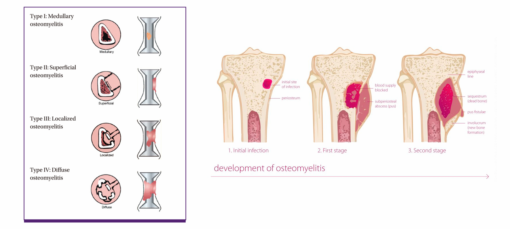
:::
:::::

<br> <br>

::: aside
The Waldvogel classification is still used because it guides management and prognosis. Hematogenous OM is often acute, responds well to antibiotics, and may not require surgery. Contiguous OM often requires surgical debridement. Vascular insufficiency implies healing challenges and often necessitates amputation.
:::

## Cierny-Mader staging of osteomyelitis

<br>

**Anatomic Type (Local)**

-   Type I: Medullary (within bone)
-   Type II: Superficial (surface erosion, no crossing of cortex)
-   Type III: Localized (cortical + medullary, 1-2 cm zone)
-   Type IV: Diffuse (entire bone involvement, significant structural loss)

**Host Status (Systemic)**

-   A-host: Normal immunity, good healing

-   B-host: Compromised (local or systemic factors: DM, CKD, immunosuppression)

-   C-host: Treatment worse than disease; comfort care preferred

<br>

**Combined Assessment:** Type + host determines operative urgency and extent

::: aside
@cierny2003
:::

::: aside
This staging is more detailed and helps guide surgical planning. A Type I, A-host osteomyelitis might respond to antibiotics alone. A Type IV, C-host patient (e.g., extensive debridement, amputation) may warrant amputation rather than limb-salvage. The C-host classification is important ethically—acknowledge when aggressive surgery would worsen quality of life.
:::

## Acute hematogenous osteomyelitis: <br> Clinical presentation {.smaller}

<br>

-   **Classic presentation**

    -   Acute onset (days)

    -   Fever, malaise, constitutional symptoms

    -   Localized bone pain, swelling, warmth

    -   Restricted motion of adjacent joint

-   **Atypical presentations**

    -   Subacute course (weeks, especially vertebral)

    -   Minimal fever or afebrile (elderly, immunocompromised)

    -   Can mimic joint pain; adjacent joint effusion common

    -   Can present with spinal cord compression (vertebral)

-   **Biofilm phase (Chronic OM)**

    -   Transition to chronic (\>3 months duration)

    -   Low-grade inflammation, sinus tracts

    -   Recurrent exacerbations

    -   Much higher failure rates with antibiotics alone

<br> <br>

::: aside
The transition from acute to chronic is insidious. Inadequately treated or delayed diagnosis of acute OM often becomes chronic OM with biofilm. Early recognition and aggressive treatment prevent this. Vertebral OM can present without fever—a patient with back pain and elevated markers could have this, requiring biopsy and imaging.
:::

## Osteomyelitis diagnosis: Laboratory markers

<br>

| Marker | Sensitivity | Specificity | Notes |
|----|----|----|----|
| **WBC (elevated)** | Variable | Low | Often normal in chronic OM |
| **ESR** | 90% | 60% | Rises slowly; normalizes slowly |
| **CRP** | 90% | 70% | More sensitive early; faster to normalize |
| **Procalcitonin** | 75-85% | 75-85% | Higher in acute; useful for monitoring |
| **Lactate** | — | — | Elevated if acute with systemic toxicity |

<br> <br>

**Limitation:** No lab marker is diagnostic; clinical + imaging correlation essential

::: notes
Lab markers support diagnosis but aren't specific. A patient with CRP 50 mg/dL and clinical symptoms needs imaging, not just antibiotics. Serial CRP is useful to monitor response to therapy—it should decline over days to weeks. Persistent elevation suggests inadequate source control.
:::

## Imaging: X-ray, MRI, advanced modalities

<br>

::::: columns
::: {.column width="50%"}
-   **X-ray:**

    -   First study, Acute findings: soft tissue swelling, periosteal reaction (2 weeks)

    -   Chronic findings: sequestra, involucrum, sinus tract

    -   **Lag time: 7-14 days before abnormalities visible**

    -   Don't exclude OM based on normal early X-rays

-   **MRI**:

    -   Gold standard - Sensitivity 82-100%, Specificity 75-96%

    -   Allows assessment of marrow involvement, soft tissue, sequestration

    -   Excellent for differentiating OM from soft tissue infection

    -   Can guide biopsy location
:::

::: {.column width="50%"}
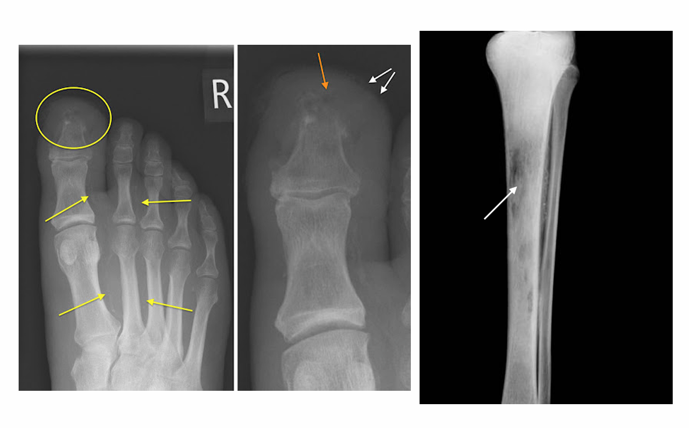
:::
:::::

::: aside
MRI is the best single imaging study for OM diagnosis and extent assessment. It shows bone marrow edema (T2 hyperintensity), which is very sensitive for OM even before structural changes appear.
:::

## Imaging: Advanced modalities

<br>

::::: columns
::: {.column width="50%"}
-   **CT:** Cortical detail, sequestra, bone destruction; useful when MRI unavailable

-   **Bone scan:** Lower sensitivity/specificity; useful if MRI contraindicated

-   **FDG-PET:** Emerging role, especially chronic OM and diabetic foot; detects metabolic activity
:::

::: {.column width="50%"}
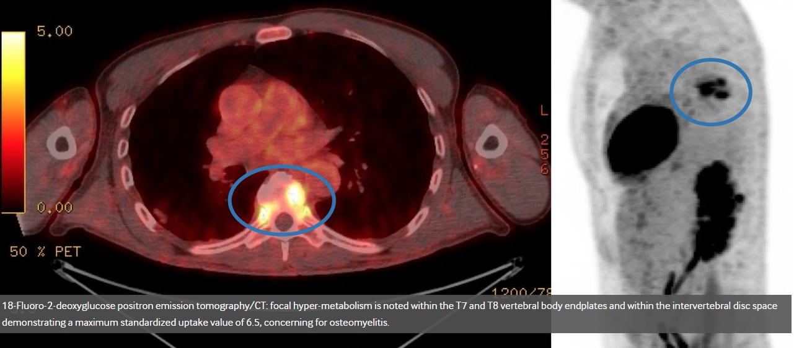
:::
:::::

::: aside
FDG-PET can differentiate OM from Charcot joint in diabetes (Charcot shows normal uptake; OM shows high uptake) and detect missed distal sites of infection. Always correlate imaging with clinical findings—isolated imaging abnormality without clinical correlation can lead to overtreatment [@arterMissedTspineOsteomyelitis2020].
:::

## Microbiologic diagnosis: <br> Bone biopsy gold standard {.smaller}

::::: columns
::: {.column width="75%"}
-   **Why Biopsy?**

    -   Identifies organism (80-90% culture yield with proper technique)

    -   Determines susceptibilities (guides directed therapy)

    -   Swab cultures unreliable (contamination, anaerobes missed)

    -   Enables molecular testing if culture negative

-   **Biopsy Technique**

    -   Percutaneous needle or open surgical approach

    -   Multiple specimens (3-5 cores minimum)

    -   Avoid skin flora contamination (chlorhexidine prep, sterile technique)

    -   Send for: culture (hold 14 days), Gram stain, AFB, fungal if risk factors

    -   Molecular testing if conventional culture negative

-   **Timing:** Before antibiotics if possible; at least within first 48 hours

-   **Challenge:** Urge to start antibiotics immediately may delay biopsy; balance speed with diagnostic yield
:::

::: {.column width="25%"}
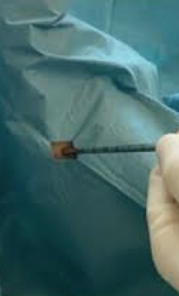{fig-align="center"}
:::
:::::

::: aside
Many clinicians start antibiotics empirically without bone culture, which creates diagnostic uncertainty and may lead to inadequate or overly broad therapy. If you reasonably suspect OM, arrange for bone biopsy before antibiotics (or very early after start, within 24-48 hours). A positive bone culture with culture negative blood and imaging consistent with OM confirms the diagnosis. Multiple specimens reduce false-negative rate due to sampling error.
:::

## Microbiology of osteomyelitis

<br>

| Type | Common Organisms |
|----|----|
| **Acute hematogenous (children)** | *S. aureus* (70-80%), streptococci, *H. influenza*e |
| **Acute hematogenous (adults)** | S. *aureus* (40-60%), GNR, streptococci |
| **IVDU, vertebral** | *S. aureus* (incl. MRSA), *Pseudomonas, Serratia* |
| **Diabetic foot** | *S. aureus*, streptococci, *E. coli, Pseudomonas,* anaerobes (polymicrobial) |
| **Post-surgical, open fracture** | *S. aureus*, streptococci, GNR, anaerobes, *Clostridium* |
| **Vertebral (non-IVDU)** | *S. aureu*s (30-50%), TB, *Brucella*, <br> fungi (in endemic areas) |

::: aside
*S. aureus* dominates across categories. In IVDU, always cover for Pseudomonas. In diabetic foot, polymicrobial coverage is empirical standard. TB must be considered in vertebral OM, especially if patient is endemic-area resident or has TB risk. Anaerobes are often overlooked in polymicrobial infections like diabetic foot OM.
:::

## Brucellosis osteomyelitis

::::: columns
::: {.column width="50%"}
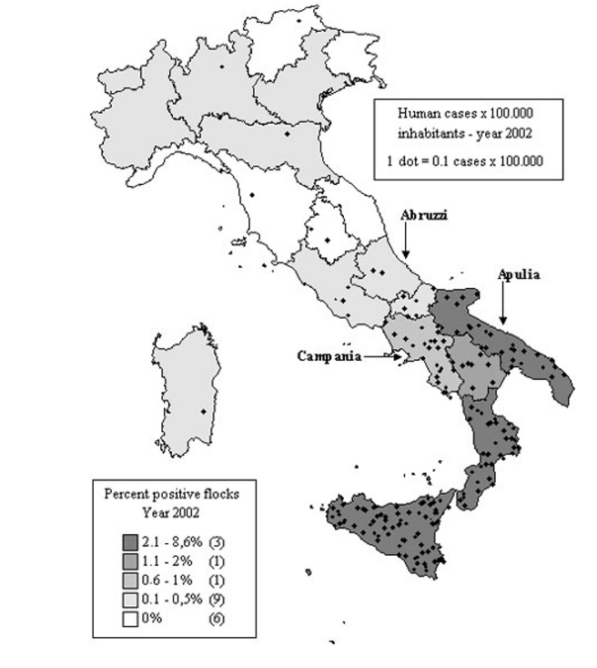{width="450"}
:::

::: {.column width="50%"}
-   Calculated occupational exposure risk of 25% (sheep-cattle farming, mild and cheese production)

-   Peak between April and June

-   Temporal correlations suggest many infections are related to the production and consumption of fresh cheese

-   Clinical features over weeks (intracellular infection with chronic inflammation :

    -   Undulating fever (night sweats, musty odor)

    -   Profound malaise, fatigue, headache, weight loss

    -   Arthralgia/arthritis

    -   **Spondylitis**

    -   **Sacrolitus**
:::
:::::

::: aside
[@massis2005]
:::

## Treatment principles: <br> Combined medical + surgical

<br>

**Source control (surgical)**: Debridement of all necrotic, infected bone and soft tissue

-   Adequate to achieve bleeding margin

-   Often requires multiple debridements

-   Dead space management (flap, cement spacer, bone graft)

**Antimicrobial therapy (medical)**: IV phase: weeks 1-4 (sometimes longer)

-   Oral phase: weeks 4+ after clinical improvement

-   Duration: 4-6 weeks total; vertebral may be 6-12 weeks

-   Bone penetration critical?- higher-dose regimens classifically recommended

**Monitoring**: Clinical response (fever, pain, function)

-   Inflammatory markers (CRP decline)

-   Imaging (structural healing takes months)

-   Culture results and susceptibilities (optimize directed therapy)

::: aside
Surgery is often underappreciated in OM treatment. Adequate debridement is more important than prolonging antibiotics if bacteria are trapped in devitalized bone. A patient with OM on day 7 still febrile on appropriate antibiotics likely needs further surgery. The surgical and medical teams must communicate regularly.
:::

## IV antimicrobial therapy for osteomyelitis (Part 1)

<br>

+----------------------------+----------------------------------------------+-------------------------------------------------+--------------------------------------------------------------------------------+
| Organism                   | First-Line                                   | Alternative                                     | Notes                                                                          |
+============================+==============================================+=================================================+================================================================================+
| **MSSA**                   | Cefazolin 2g q8h                             | Oxacillin 2g q4h or                             | While antistaphylococcal PCNs hav ebetter bone penetration, cefazolin is safer |
|                            |                                              |                                                 |                                                                                |
|                            |                                              | Nafcillin 2g q4h or                             |                                                                                |
+----------------------------+----------------------------------------------+-------------------------------------------------+--------------------------------------------------------------------------------+
| **MRSA**                   | Daptomycin 10 mg/kg daily                    | Vancomycin 15-20 mg/kg q8-12h (AUC/MIC 400-600) | Target higher vancomycin AUC for bone OM                                       |
+----------------------------+----------------------------------------------+-------------------------------------------------+--------------------------------------------------------------------------------+
| **Streptococci (GASTREP)** | Penicillin G 4 MU q4h or Ceftriaxone 2g q12h | Vancomycin if allergy                           | Excellent bone penetration                                                     |
+----------------------------+----------------------------------------------+-------------------------------------------------+--------------------------------------------------------------------------------+

::: aside
Historical preference for antistaphylococcal penicillins over cefazolin for deep-seated infections was based on theoretical concerns about the inoculum effect and bone penetration rather than clinical evidence.
:::

## IV antimicrobial therapy for osteomyelitis (Part 2)

<br>

| Organism | First-Line | Alternative | Notes |
|----|----|----|----|
| **Enterococci** | Ampicillin 2g q4h (if susceptible) | Vancomycin 15-20 mg/kg q8-12h | High-dose ampicillin preferred; never monotherapy fluoroquinolone |
| **Gram-negative rods (E. coli, Klebsiella)** | Cefepime 2g q12h or Meropenem 1g q8h | Fluoroquinolone (levofloxacin 750 daily) | Cephalosporin or carbapenem preferred; fluoroquinolone inferior |
| **Pseudomonas aeruginosa** | Cefepime 2g q12h or Piperacillin-tazobactam 4.5g q6-8h | Meropenem 1g q8h, Fluoroquinolone | Dual coverage sometimes advocated early; optimize based on susceptibilities |

::: notes
Gram-negative OM is challenging because fluoroquinolones, while oral-available, have lower efficacy than beta-lactams. Cefepime and piperacillin-tazobactam are better choices if patient tolerates IV. Pseudomonas is particularly difficult because of biofilm formation and resistance. High-dose antipseudomonal therapy is essential.
:::

## Oral step-down therapy: OVIVA trial paradigm shift {.smaller}

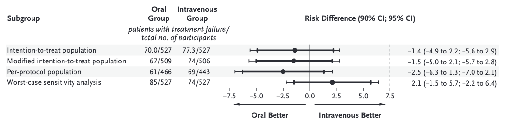{fig-align="center" width="800"}

**Design**: RCT, 200 adult patients with bone/joint infection

-   Randomized to IV antibiotics (≥2 weeks) vs. early oral step-down (≥4 weeks total)

-   Primary endpoint: relapse/failure at 1 year

**Results**: IV group: 8/97 relapsed (8%) , Oral step-down group: 13/103 relapsed (13%)

-   **Non-inferiority of oral step-down demonstrated**: Oral group: faster return to function, fewer complications

-   **Inclusion Criteria**:

    -   Bacterial bone/joint infection (native or prosthetic)

    -   Able to take oral medication

    -   No endocarditis

    -   Clinical improvement within 2 weeks

<br>

::: aside
[@li2019]
:::

## Oral therapy regimens for osteomyelitis (Part 1)

<br>

| Organism | First-Line Oral | Duration | Notes |
|----|----|----|----|
| **MSSA** | Flucloxacillin 1-1.5g PO q6h (if available) | Total 4-6 wks | Excellent oral MSSA option in Europe; not available in US |
| **MSSA (USA)** | Cephalexin 500-750 mg PO q6h | Total 4-6 wks | Good absorption; limit to less severe |
| **MSSA (USA, preferred)** | Levofloxacin 750 mg PO daily ± Rifampin 600 mg daily | Total 4-6 wks | Fluoroquinolone penetration excellent; add rifampin for biofilm |
| **MRSA (preferred)** | Linezolid 600 mg PO q12h | Total 4-6 wks | Excellent bioavailability; monitor for bone marrow toxicity \>2 wks |

::: notes
The OVIVA trial used fluoroquinolones + rifampin for Staph OM because of excellent bioavailability and bone penetration. Linezolid offers similar advantages for MRSA but bone marrow toxicity limits duration. In Europe, flucloxacillin remains available and is an excellent MSSA option. In the US, oral options are more limited. Always confirm organism susceptibility (especially for fluoroquinolones and rifampin) before prescribing.
:::

## Oral therapy regimens for osteomyelitis (Part 2)

<br>

| Organism | First-Line Oral | Duration | Notes |
|----|----|----|----|
| **Streptococci (penicillin-S)** | Amoxicillin 500-750 mg PO q6h | Total 4-6 wks | Excellent absorption; standard option |
| **Enterococci** | Amoxicillin 500-750 mg PO q6h | Total 4-6 wks | Ampicillin equivalent; ensure susceptibility |
| **Enterobacteriaceae** | Cephalexin 500 mg PO q6h or Levofloxacin 750 daily | Total 4-6 wks | Fluoroquinolone preferred for difficult organisms |
| **Pseudomonas** | Levofloxacin 750 mg PO daily ± Rifampin 600 mg daily | Total 4-6 wks | High-dose fluoroquinolone; add rifampin preferred; monitor susceptibility |

::: notes
For enterobacteria and Pseudomonas, fluoroquinolone monotherapy (especially levofloxacin 750 mg daily) has decent outcomes in OM because of excellent bone penetration. However, resistance development is a risk—add rifampin for combination therapy if biofilm suspected. Always ensure adequate absorptive capacity (no severe diarrhea, functional GI tract).
:::

## Rifampin in bone and joint infections

<br>

::::: columns
::: {.column width="50%"}
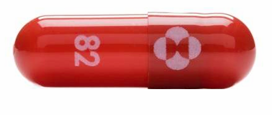
:::

::: {.column width="50%"}
-   **Unique properties**:

    -   Excellent intracellular penetration, kills biofilm-associated bacteria (10-100× better than monotherapy)

    -   Penetrates bone better than most antibiotics - Achieves high synovial concentrations

-   **Rules for use**

    -   **NEVER monotherapy** — rapidly selects resistance

    -   Always combine with second agent (fluoroquinolone, beta-lactam, or linezolid)

    -   Monitor for drug interactions (CYP3A4 inducer; reduces protease inhibitors, warfarin, many others)

    -   Monitor hepatotoxicity (AST/ALT baseline and repeat)

    -   Can cause orange discoloration of body fluids (benign)

-   **Dosing:** 600 mg IV/PO daily
:::
:::::

::: aside
Warn patients about orange urine/saliva and check for interactions before prescribing. The CYP3A4 induction is significant—monitor INR if on warfarin, virologic response if on ARVs.
:::

## Vertebral osteomyelitis treatment duration {.smaller}

<br>

::::: columns
::: {.column width="50%"}
{width="350"}
:::

::: {.column width="50%"}
-   **Bernard et al., Lancet 2015** (RCT, vertebral OM)
    -   Compared 6 weeks vs. 12 weeks IV antibiotics
    -   Primary outcome: clinical and microbiologic cure at 2 years
    -   6-week group: 82% cure
    -   12-week group: 84% cure
    -   **Non-inferiority of 6 weeks demonstrated**
-   **Practical Implications**
    -   6 weeks IV (or IV → PO switch) standard for vertebral OM
    -   No benefit to prolonging beyond 6 weeks
    -   Imaging (MRI) normalizes slowly (weeks to months); don't use as endpoint
    -   Assess by clinical improvement + inflammatory marker decline
-   **Caveats**
    -   Requires adequate source control (rarely needs surgery)
    -   Monitor for spinal cord compression (urgent imaging/decompression needed)
    -   TB and fungal OM may require longer therapy
:::
:::::

::: aside
[@bernard2015]
:::

## Diabetic foot osteomyelitis {.smaller}

::::: columns
::: {.column width="65%"}
-   **Risk Factors**
    -   Ulceration (duration \>4 weeks increases OM risk \~40%)
    -   Neuropathy (loss of protective sensation)
    -   Poor glycemic control
    -   Peripheral vascular disease
    -   Prior ulceration
-   **Pathogenesis**
    -   Contiguous spread from infected ulcer to bone
    -   Usually direct extension from soft tissue focus
    -   Polymicrobial (3-5 organisms common)
    -   Biofilm formation common
-   **Epidemiology**
    -   Affects 10-20% of diabetic patients with foot ulcers
    -   Leading infectious cause of non-traumatic amputation
    -   Rising incidence with obesity and IVDU epidemic
:::

::: {.column width="35%"}
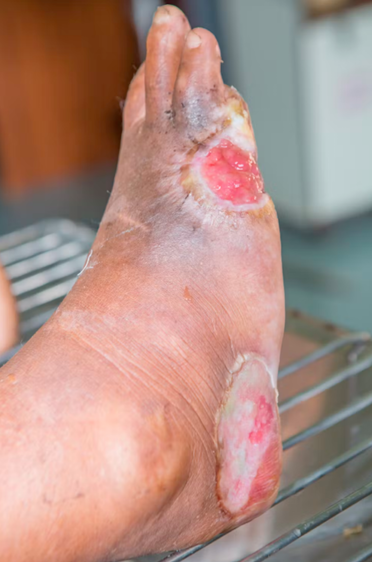{fig-align="center" width="300"}
:::
:::::

::: aside
Diabetic foot OM is mostly preventable with good wound care, glycemic control, and timely identification of at-risk ulcers. The key is early recognition—if an ulcer doesn't improve in 2-4 weeks, image for OM. Recurrence is common (up to 30%), emphasizing ongoing wound care.
:::

## Diabetic foot osteomyelitis: <br> Diagnosis and microbiology {.smaller}

<br>

::::: columns
::: {.column width="50%"}
-   **Diagnosis** - **Probe-to-bone test:** PPV 89% in high-risk patients; simple bedside test

-   **Imaging:** X-ray (late findings), MRI gold standard

-   **Culture:** Preferably from bone biopsy; superficial swab unreliable

-   **Lab markers:** CRP elevated; WBC often normal

-   **Microbiology** (polymicrobial)

    -   **Common:** *S. aureus, streptococci, E. coli, Pseudomonas, Enterococcus*

    -   **Anaerobes:** Often present (*Peptostreptococcus, Prevotella, Bacteroides*)

    -   **MRSA:** Risk if prior antimicrobials or hospitalization

    -   **Unusual:** Mycobacterium, fungi (if immunocompromised)
:::

::: {.column width="50%"}
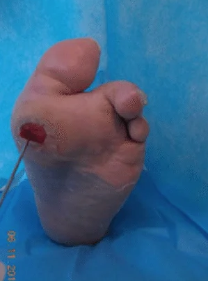{fig-align="center"}
:::
:::::

::: aside
The probe-to-bone test is your rapid clinical assessment—if you can pass a sterile probe through a diabetic ulcer to bone, OM is present until proven otherwise. Empirical therapy must cover gram-positives, gram-negatives, and anaerobes. Many regimens use a fluoroquinolone (for gram-negative and anaerobic coverage) + additional agent, or broad-spectrum agent like piperacillin-tazobactam.
:::

## Diabetic foot osteomyelitis: <br> Medical vs. surgical management {.smaller}

<br>

-   **Medical Management**

    -   Indications: Limited bone involvement, good perfusion, able to heal

    -   Duration: 4-6 weeks, often oral after initial IV phase

    -   Requires adequate debridement of surrounding soft tissue

    -   Success: \~60-70% in selected cases

-   **Surgical Management**

    -   Indications: Extensive bone involvement, vascular insufficiency, sepsis

    -   Goal: Remove all infected bone

    -   May require partial foot amputation (\>50% cases)

    -   Often combined with vascular intervention

-   **Amputation Rates**

    -   \~20-30% of patients with diabetic foot OM undergo amputation

    -   Higher if vascular disease present

    -   Lower with early aggressive debridement and optimal antibiotics

::: aside
The choice between medical and surgical management should be individualized. A patient with well-perfused foot, limited cortical erosions on imaging, and mild systemic symptoms might be a candidate for medical therapy. A patient with necrotizing fascia, extensive bone involvement, or severe vascular disease likely needs amputation. Vascular assessment is critical—antibiotics alone won't work if there's no blood supply.
:::

## Culture-negative osteomyelitis {.smaller}

<br>

-   **Common causes**

    -   Prior antibiotic therapy (30-50% of cases)

    -   Slow-growing or fastidious organisms (mycobacteria, fungi, Brucella)

    -   Technical sampling issues (inadequate specimen, contamination)

    -   Fastidious organisms (Bartonella, Coxiella, Mycoplasma)

-   **Diagnostic approach**

    -   Repeat biopsy with careful technique

    -   Hold cultures 14 days minimum

    -   Gram stain, AFB, fungal cultures

    -   Molecular testing (PCR, 16S rDNA, mNGS) if available

-   **Empirical therapy**

    -   Continue antibiotics based on most likely organism(s)

    -   *S. aureus* coverage essential (high prevalence)

    -   Consider TB coverage if risk factors or imaging suggestive

    -   Fungal coverage if immunocompromised

::: aside
Culture-negative OM is challenging but not uncommon. Don't give up on diagnosis—persistent fever, abnormal imaging, and elevated markers in the setting of clinical OM warrant continued investigation. Molecular diagnostics (16S rDNA PCR, mNGS) are increasingly available and can identify organisms missed by conventional culture. Prior antibiotics are the most common reason for negative cultures; ask about recent therapy.
:::

## Vertebral osteomyelitis (spondylodiscitis) {.smaller}

<br>

::::: columns
::: {.column width="50%"}
**Epidemiology**

-   1-2% of all OM cases; increasing incidence

-   Risk factors: IVDU, age \>60, DM, immunosuppression

-   Most common location: lumbar spine (50%), thoracic 40%, cervical 10%

**Microbiology**

-   S. aureus: 30-70% (especially IVDU)

-   Streptococci: 10-20%

-   Gram-negative: 5-15% (more common in IVDU)

-   TB, Brucella: Consider if epidemiologic risk

**Presentation**

-   Fever (often low-grade), back/flank pain

-   May have neurologic symptoms (cord compression)

-   Can mimic musculoskeletal pain initially; diagnosis delayed
:::

::: {.column width="50%"}
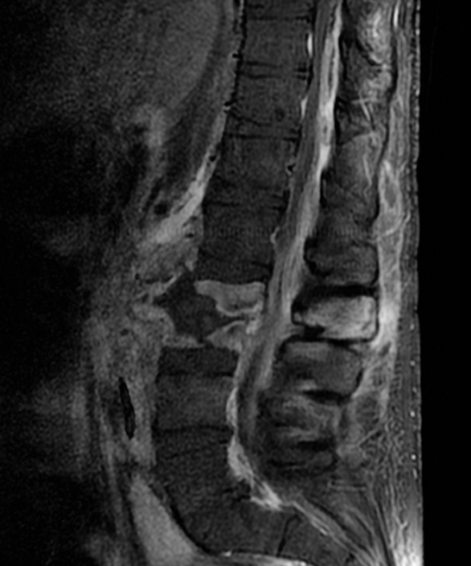{fig-align="center" width="350"}
:::
:::::

::: aside
Vertebral OM is easy to miss because it can present as simple back pain. Always maintain suspicion in elderly or high-risk patients with fever and back pain. MRI is essential for diagnosis. Early recognition prevents neurologic sequelae. IVDU with fever and back pain = vertebral OM until proven otherwise.
:::

## Sickle cell disease osteomyelitis {.smaller}

<br>

::::: columns
::: {.column width="50%"}
-   **Salmonella:** 50-70% of osteomyelitis <br> (unusual organism for non-sickle OM)

-   **S. aureus:** 20-30%

-   ***Streptococci, Pseudomonas*****:** Less common than other populations

-   **Why Salmonella?** - GI carriage increased in sickle disease

    -   Sickling predisposes to bone infarcts → seeding

    -   Damaged splenic function → impaired opsonization

-   **Clinical Presentation**

    -   Acute fever, bone/joint pain

    -   Multiple bones often involved

    -   High mortality if untreated

-   **Therapy**

    -   Cover Salmonella empirically (fluoroquinolone, 3rd gen cephalosporin)

    -   Add S. aureus coverage

    -   Blood culture critical for organism identification
:::

::: {.column width="50%"}
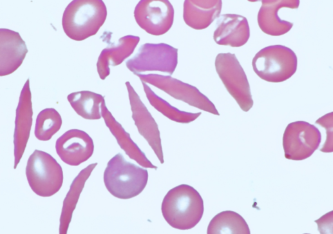{width="300"}
:::
:::::

::: aside
Sickle cell patients with osteomyelitis need cover Salmonella empirically. Most non-sickle OM therapies would miss Salmonella. Fluoroquinolone monotherapy is often adequate for Salmonella, but may not adequately cover S. aureus.
:::

## Tuberculous osteomyelitis (Pott's Disease)

<br>

::::: columns
::: {.column width="75%"}
-   **Epidemiology**

    -   10-20% of TB patients have skeletal involvement

    -   Spine: lumbar 50%, thoracic 49%, cervical 1%

    -   Hip, knee: rarer

    -   Increasing in TB-endemic areas; re-emerging in developed countries

-   **Pathogenesis**

    -   Hematogenous seeding (usually from pulmonary TB)

    -   Affects vertebral bodies (not disc initially)

    -   Slow progression with granulomatous inflammation

    -   Can cause severe kyphosis, spinal cord compression

-   **Diagnosis**

    -   MRI shows vertebral involvement

    -   Biopsy: caseating granulomas (pathognomonic)

    -   Culture: slow (4-8 weeks); PCR faster

    -   Always evaluate for pulmonary TB concurrently
:::

::: {.column width="25%"}
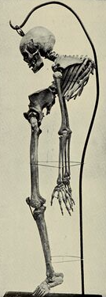{fig-align="center"}
:::
:::::

::: aside
TB OM is easy to miss because it's chronic and imaging-intensive work-up is needed. Always ask about TB exposure, cough, constitutional symptoms in patients with chronic vertebral pain. Early diagnosis and anti-TB therapy prevent permanent neurologic damage. Pyrazinamide is critical for TB OM (penetrates bone well); standard TB regimens are 2 months intensive (HRZE) + 4 months continuation (HR).
:::

## IVDU-related osteomyelitis and complications {.smaller}

<br>

::::: columns
::: {.column width="50%"}
-   **Common Sites**

    -   Vertebral (lumbar \> thoracic)

    -   Sternoclavicular joint

    -   Pubic bone

    -   Sacroiliac joint

-   **Organisms**

    -   S. aureus (MSSA and MRSA): 60-80%

    -   Pseudomonas aeruginosa: 30-50%

    -   Polymicrobial: 20-30%

-   **Complications**

    -   Spinal cord compression (vertebral)

    -   Endocarditis (concurrent risk)

    -   Embolic phenomena

    -   High recurrence rates

-   **Management**

    -   Medical therapy usually sufficient (avoid surgery if possible)

    -   Source control: address continued IVDU

    -   Long-term follow-up: recurrence common
:::

::: {.column width="50%"}
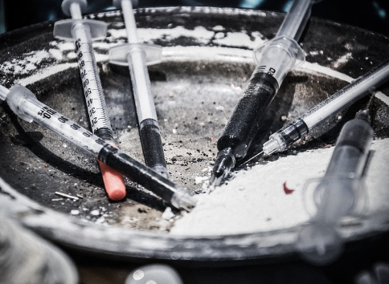
:::
:::::

::: notes
IVDU-related OM is a growing problem. The organisms are predictable (Staph, Pseudomonas), so empirical therapy should cover both. The biggest challenge is patient compliance and addressing ongoing IV drug use. Many of these patients are on medication-assisted therapy; ensure it's continued during treatment. Social work and addiction medicine involvement is essential.
:::

# Part III: Prosthetic Joint Infection {background-color="#b20e10"}

## Prosthetic joint infection: Epidemiology and definitions

<br>

::::: columns
::: {.column width="50%"}
**Incidence**

-   1-2% of primary total joint arthroplasties (TJA)

-   Rising due to aging population, increased TJA volume

-   Costs: \$50,000-100,000+ per episode

-   Can be devastating (functional loss, multiple surgeries, potential amputation)

**EBJIS Definition (European Bone and Joint Infection Society)**

-   Major criterion: Positive culture of ≥2 tissue/fluid samples

    -   *OR* purulent joint fluid

    -   *OR* sinus tract communicating to joint

-   Plus one minor criterion:

    -   elevated inflammatory markers + symptoms
:::

::: {.column width="50%"}
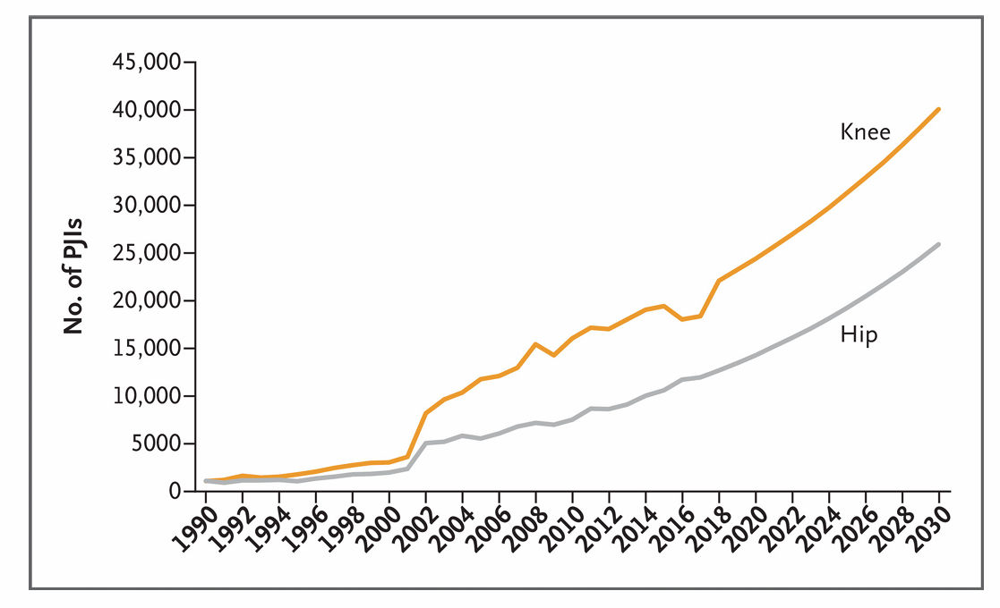
:::
:::::

::: aside
PJI is becoming more common and more expensive to treat. Prevention through perioperative prophylaxis is essential. Treatment is complex, often requiring surgery, and outcomes even with modern therapy are imperfect (success rates 70-90% depending on strategy). The cost and morbidity motivate aggressive prevention [@patel2023a].
:::

## Prosthetic joint infection

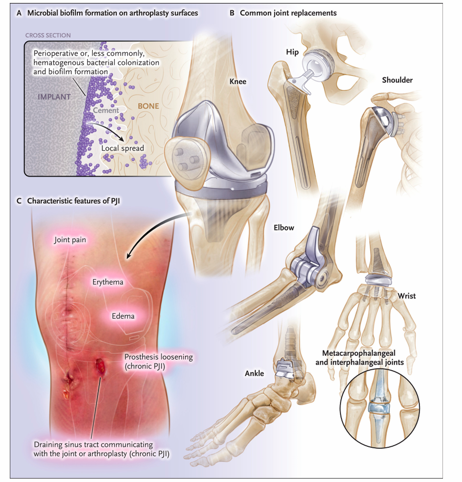{fig-align="center" width="500"}

::: aside
[@patel2023a]
:::

## Classification of prosthetic joint infection

<br>

| Timing | Definition | Organisms | Management |
|----|----|----|----|
| **Early** | \<4 weeks post-op | S. aureus, streptococci, gram-negatives | Often DAIR; consider exchange if late in interval |
| **Acute Hematogenous** | Any time post-op; acute presentation | S. aureus, streptococci, gram-negatives | Often DAIR if early response |
| **Chronic** | \>4 weeks (usually months to years) | CoNS (esp. if indolent), S. aureus, Cutibacterium (shoulder), gram-negatives | Two-stage exchange standard |

<br>

**Early vs. Chronic Distinction**

-   Early: organisms typically from surgical site/inoculation

-   Chronic: biofilm established, lower inflammatory response, often CoNS

-   Clinical presentation drives management more than timing alone

::: aside
The classification by timing helps frame management decisions. Early infection caught within days of surgery might be salvageable with DAIR (debridement, antibiotics, implant retention). Chronic infection with established biofilm usually requires exchange. However, acute hematogenous infection (even years post-op) may respond to DAIR if caught early in the course.
:::

## Pathogenesis: Biofilm on prosthetic implants {.smaller}

<br>

::::: columns
::: {.column width="50%"}
-   **Biofilm formation timeline**

    -   **Minutes to hours:** Bacterial adherence to implant surface

    -   **Hours to days:** Microcolony formation, EPS (exopolysaccharide) production

    -   **Days to weeks:** Mature biofilm with channel/void structure

-   **Properties of biofilm**

    -   Resistance to antibiotics: 1000-fold higher than planktonic bacteria

    -   Resistance to phagocytes: EPS shields bacteria

    -   Impaired immune access (poor penetration of antibodies, complement)

    -   Slow growth allows dormancy and phenotypic switching

-   **Clinical implications**

    -   Biofilm must be mechanically removed (surgery)

    -   Antibiotics alone insufficient for mature biofilm

    -   Rifampin and daptomycin have better biofilm activity
:::

::: {.column width="50%"}
<br> <br>

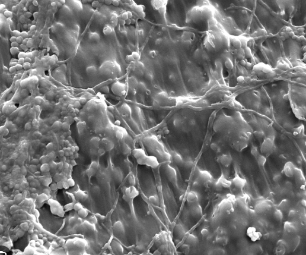{fig-align="center" width="400"}
:::
:::::

::: notes
The biofilm paradigm explains why PJI treatment requires both surgery (remove the implant and biofilm) and prolonged antibiotics (suppress remaining bacteria). Bacteria in biofilm are up to 1000× more resistant to antibiotics than free-floating cells, which is why standard durations and doses often fail. This is also why DAIR (keeping the implant) only works in early infection before mature biofilm forms.
:::

## Microbiologic features of prosthetic joint infection

<br>

-   **Most common organisms overall**

    -   **Coagulase-negative staphylococci (CoNS):** 30-40% (most common)

    -   **Staphylococcus aureus:** 20-30% (most virulent)

    -   **Streptococci:** 10-15%

    -   **Gram-negative rods:** 5-10%

    -   **Anaerobes:** 3-5%

    -   **Culture-negative:** 5-10%

-   **Site-specific patterns**

    -   **Shoulder:** *Cutibacterium acnes* (formerly Propionibacterium), skin flora

    -   **Knee/Hip:** CoNS, S. aureus dominate

    -   **IVDU patients:** S. aureus (MRSA common), Pseudomonas, polymicrobial

-   **Organism-prognosis correlation**

    -   CoNS: slower course, lower mortality, easier to treat

    -   S. aureus: faster, more virulent, higher failure rates, consider endocarditis risk

    -   Gram-negatives: challenging, require potent agents

::: aside
The organism matters for prognosis and therapy selection. CoNS may present insidiously with sinus drainage and mild symptoms. S. aureus presents acutely with pain, fever, systemic toxicity. Cutibacterium acnes on the shoulder may be difficult to culture (slow growth, fastidious), requiring prolonged incubation and molecular diagnostics. Culture and organism ID are critical for optimal therapy.
:::

## Risk factors for prosthetic joint infection

<br>

| Risk factor | Mechanism | Relative risk |
|----|----|----|
| **Obesity** | Impaired immune response, wound complications | 1.5-2× |
| **Diabetes mellitus** | Impaired wound healing, immunosuppression | 2-3× |
| **Rheumatoid arthritis** | Immunosuppressive therapy, joint inflammation | 2-3× |
| **Immunosuppression** (TNFi, steroids, etc.) | Direct immune suppression | 2-5× |
| **Prior arthroplasty** | Revision procedure, tissue trauma | 2-3× |
| **Surgical site infection/complications** | Direct inoculation | 3-5× |
| **Male sex** (controversial) | Possibly worse wound healing | 1.2-1.5× |

::: aside
The modifiable risk factors (obesity, DM control) should be optimized pre-operatively. The non-modifiable factors (prior surgery, immunosuppression) should inform perioperative prophylaxis intensity and duration. Anticipate higher infection risk in obese, diabetic, or immunosuppressed patients and consider extended prophylaxis or alternative strategies.
:::

## Diagnosis of PJI: Serum Markers

<br>

| Marker | Sensitivity | Specificity | Notes |
|----|----|----|----|
| **CRP** | 85-90% | 60-65% | Elevated \>10 mg/L suggestive; <br>returns to normal within weeks of eradication |
| **ESR** | 75-80% | 50-60% | Less specific; rises slowly; slower to normalize than CRP |
| **D-dimer** | 85-90% | 40-50% | Emerging marker; promising but not yet standard |
| **Procalcitonin** | Variable | Variable | Limited data in PJI; not standard |
| **Combination** | \>95% | \>70% | ESR + CRP improves discrimination from aseptic loosening |

<br>

**Limitation:** No serum test rules in or out PJI; aspiration essential for diagnosis

::: aside
Serum markers help guide suspicion and are useful in combination (ESR + CRP elevated together = higher pretest probability). However, aseptic loosening can also elevate these, so they're not diagnostic. Aspiration is always required if PJI suspected. D-dimer is being studied as a rapid assessment tool before aspiration—a negative D-dimer might lower suspicion, but data are limited.
:::

## Synovial fluid analysis in PJI

<br>

::::: columns
::: {.column width="50%"}
{fig-align="center" width="350"}
:::

::: {.column width="50%"}
**Key differences from native joint**

-   Lower WBC threshold for concern (\>2,000 /μL suggestive, vs. \>50,000 for native joint)

-   PMN % \>70% supportive but not diagnostic

-   Glucose less useful than in native joint

-   Negative culture doesn't exclude PJI (10-30% culture-negative in some series)

**Novel biomarkers (synovial)**

-   **Alpha-defensin:** Sensitivity 95-97%, Specificity 97-99%; excellent discrimination

-   **Leukocyte esterase:** Rapid (15 min), high sensitivity/specificity

-   **IL-6, IL-8:** Research markers; not yet standard clinical use

-   **PCR:** Culture-independent; positive if organism DNA detected
:::
:::::

::: aside
Alpha-defensin is an antimicrobial peptide elevated in infected joints; it's highly sensitive and specific for PJI and available as a simple test (LE.culture system). Leukocyte esterase strip testing is cheaper and faster but perhaps less sensitive than alpha-defensin. Molecular testing (PCR) is especially useful for culture-negative cases or fastidious organisms (Cutibacterium).
:::

## Intraoperative diagnosis: Sonication and culturing strategy

<br>

::::: columns
::: {.column width="35%"}
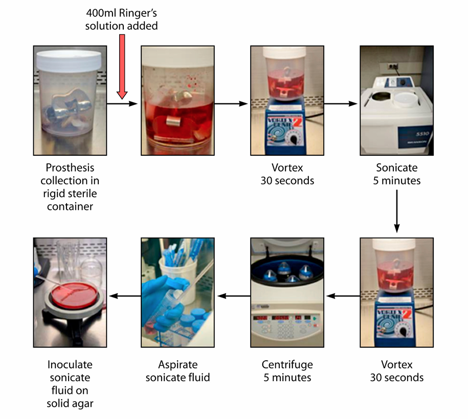{width="600"}
:::

::: {.column width="65%"}
-   **Sonication of explanted prosthesis**

    -   Ultrasonic disaggregation of biofilm from explanted implant

    -   Increases culture sensitivity by \~20% vs. standard tissue culture

    -   Sends fluid for culture, Gram stain, PCR

    -   Can be done simultaneously with standard cultures

-   **Tissue/fluid culture strategy**

    -   Obtain ≥3-5 tissue samples (each in separate culture bottle)

    -   Samples from different locations (synovium, periprosthetic, opposite side)

    -   Aerobic and anaerobic cultures

    -   Hold cultures minimum 14 days (CoNS, Cutibacterium slow)

    -   Gram stain, AFB if TB risk

-   **Molecular diagnostics**

    -   PCR for common organisms

    -   16S rDNA, mNGS for culture-negative/fastidious organisms

    -   Useful especially for *Cutibacterium acnes*
:::
:::::

::: aside
[@Trampuz2007]
:::

::: aside
Obtaining multiple tissue samples from different sites increases diagnostic yield and confidence (≥2 positive samples = diagnostic for PJI per EBJIS criteria). Sonication is increasingly standard practice in PJI surgery centers. The 14-day holding period is essential—don't sign out as negative at 48 hours. CoNS and Cutibacterium may take 5-7 days to grow.
:::

## Diagnostic algorithm for suspected PJI

<br>

-   **Step 1: Clinical assessment**

    -   Symptoms (pain, drainage, warmth, swelling)

    -   Labs (CRP, ESR)

    -   Imaging (loosening, peri-implant lucencies, sinus tract)

-   **Step 2: Joint aspiration**

    -   Urgent if acute symptoms or high suspicion

    -   Synovial fluid: WBC, PMN, glucose, culture, Gram stain

    -   Novel biomarkers (alpha-defensin) if available

    -   Molecular testing if culture-negative suspected

-   **Step 3: Imaging**

    -   X-ray (baseline, assess loosening)

    -   MRI/CT if diagnosis unclear or surgical planning needed

-   **Step 4: Decision point**

    -   If high pretest probability: proceed to operative aspiration/biopsy

    -   If intermediate: repeat labs in 1-2 weeks or proceed to surgery

    -   If low: conservative management, serial follow-up

::: aside
The diagnostic algorithm balances speed with accuracy. A patient with acute fever, purulent drainage from sinus tract, and WBC 10,000 in synovial fluid has PJI until proven otherwise—go to surgery. A patient with insidious pain, elevated ESR, but negative initial aspiration might warrant repeat aspiration or observation. Culture-negative results require correlation with clinical suspicion and operative findings.
:::

## Treatment algorithm: <br> DAIR vs. one-stage vs. two-stage exchange {.smaller}

-   **DAIR (Debridement, Antibiotics, Implant Retention)**

    -   **Indications:** Early infection (\<4 weeks), acute hematogenous (if caught early), patient refuses exchange

    -   **Procedure:** Thorough debridement, modular exchange (if possible), preservation of primary implant

    -   **Success:** 50-70% eradication (varies by organism, timing, duration)

    -   **Advantages:** Single surgery, preservation of bone stock

    -   **Disadvantages:** Failure rates 30-50%; requires close follow-up

-   **One-Stage Exchange** - **Growing evidence for success (70-90%)**

    -   **Indications:** Selected cases (good bone stock, controlled infection, no systemic sepsis, adequate soft tissue)

    -   **Advantages:** Single surgery, patient tolerates better

    -   **Disadvantages:** Technically demanding, higher morbidity if infection persists

-   **Two-Stage Exchange** (Gold Standard for Chronic PJI)

    -   **Procedure:** Explant → 6-week antibiotic spacer phase → Reimplantation

    -   **Success:** 85-95% eradication

    -   **Advantages:** Highest success rate, bone stock remodeling, staged risk

    -   **Disadvantages:** Two surgeries, extended treatment period, temporary disability

    <br> <br>

::: aside
The choice of surgical strategy depends on the infection (early vs. chronic), organism (biofilm burden), patient factors (age, comorbidities), and bone quality. DAIR works best in early infections caught within 2 weeks and with susceptible organisms like streptococci. Two-stage is the traditional gold standard for chronic infections with high success rates. One-stage exchange is gaining acceptance as outcomes data accumulate and surgical techniques improve.
:::

## Pathogen-specific therapy for PJI (Part 1)

<br>

| Organism | IV Phase | Oral/Suppressive Phase | Duration |
|----|----|----|----|
| **MSSA** | Cefazolin 2g q8h or oxacillin/nafcillin 2g q4h | Cephalexin 500-750 PO q6h OR Levofloxacin 750 daily + Rifampin 600 daily | IV 2 wks, then PO 4-6 wks (total 6-8 wks) |
| **MRSA** | Daptomycin 10 mg/kg daily OR Vancomycin 15-20 mg/kg q8-12h (AUC/MIC 400-600) | Linezolid 600 mg PO q12h OR Levofloxacin 750 + Rifampin 600 (if susceptible) | IV 2 wks, then PO 4-6 wks (total 6-8 wks) |
| **CoNS** | Daptomycin 10 mg/kg daily OR Vancomycin 15-20 mg/kg q8-12h | Linezolid 600 mg q12h OR Levofloxacin + Rifampin | IV 2 wks, then PO 4-6 wks (DAIR); longer if exchange |

::: aside
The organisms guide therapy. MSSA responds well to cephalosporins or anti-staphylococcal penicllins. MRSA and CoNS require daptomycin or vancomycin initially. Rifampin is often added to the oral phase because of its biofilm activity, though evidence for benefit is stronger in PJI than elsewhere. Duration depends on surgical strategy: DAIR may be shorter if successful; two-stage exchange typically 6 weeks IV spacer + 4-6 weeks final antibiotics = 10-12 weeks total.
:::

## Pathogen-specific therapy for PJI (Part 2)

<br>

| Organism | IV Phase | Oral/Suppressive Phase | Notes |
|----|----|----|----|
| **Streptococci** | Penicillin G 4 MU q4h OR Cefazolin 2g q8h | Amoxicillin 500 mg PO q6h OR Cephalexin 500 mg q6h | Excellent outcomes; can de-escalate early |
| **Enterococci** | Ampicillin 2g q4h (if susceptible) OR Vancomycin + Gentamicin | Amoxicillin 500 mg q6h (if susceptible) | Require synergistic therapy; difficult to cure |
| **Enterobacteriaceae** | Cefepime 2g q12h OR Meropenem 1g q8h | Levofloxacin 750 daily OR Cephalexin (if susceptible) | Fluoroquinolone high bioavailability |
| **Pseudomonas** | Cefepime 2g q12h OR Piperacillin-tazobactam 4.5g q6h | Levofloxacin 750 daily ± Rifampin | High-dose fluoroquinolone; poor cure rates |
| **Cutibacterium acnes** | Penicillin G 4 MU q4h | Amoxicillin 500 mg q6h | Slow-growing; shoulder joint common |
| **Anaerobes** | Meropenem OR Piperacillin-tazobactam | Amoxicillin-clavulanate OR Clindamycin | Often polymicrobial; cover gram-negative |

::: aside
Enterococci are notoriously difficult to cure—they require synergistic therapy and high failure rates are expected. Cutibacterium acnes, especially on the shoulder, can be subtle; cultures require prolonged incubation (7-10 days). Anaerobes are often overlooked in polymicrobial PJI. Pseudomonas OM/PJI is challenging—fluoroquinolones are preferred for bioavailability, but cure rates remain suboptimal even with optimal therapy.
:::

## Rifampin in prosthetic joint infections: <br> Landmark Evidence

<br>

::::: columns
::: {.column width="50%"}
-   **JAMA 1998** (RCT)[@zimmerli1998]

    -   Compared flucloxacillin alone vs. flucloxacillin + rifampin in MSSA PJI

    -   All underwent surgical debridement and implant retention

    -   **Rifampin group: 100% success**

    -   **Fluoroquinolone alone group: 67% success**

-   **Current Use**

    -   Rifampin added to IV phase (at least 2 weeks)

    -   Continued in oral phase (with fluoroquinolone or other agent)

    -   Essential for biofilm-related infections (prosthetic, osteomyelitis)

    -   Always combination therapy; never monotherapy

    -   Drug interactions and hepatotoxicity monitoring required
:::

::: {.column width="50%"}
<br> <br> <br>

{width="350"}
:::
:::::

::: aside
Zimmerli et al., *JAMA*, 1998
:::

::: aside
The Zimmerli trial is the basis for modern PJI therapy with rifampin. The 100% success with combination therapy was striking compared to 67% with monotherapy. However, note that all patients underwent surgery (DAIR)—antibiotics alone are insufficient even with rifampin. Monitor for CYP3A4 interactions and AST/ALT elevation. Orange discoloration of body fluids is common and benign.
:::

## Suppressive therapy in prosthetic joint infection

<br>

-   **Indications** - Patient unfit for surgery or refuses surgery

    -   Multiple failed eradication attempts

    -   Immunocompromised unable to tolerate multiple surgeries

    -   Palliative care goals

-   **Agents used**

    -   Fluoroquinolone (levofloxacin 750 mg daily) + Rifampin 600 mg daily

    -   Linezolid 600 mg q12h (if Staph)

    -   Doxycycline (if susceptible)

    -   Continued indefinitely (until death, implant removal, or status change)

-   **Outcomes**

    -   Suppresses symptoms (pain, drainage) but doesn't eradicate infection

    -   Biofilm remains; recurrence if therapy stopped

    -   Quality of life improved vs. surgery in selected patients

    -   Long-term antimicrobial toxicity (bone marrow, GI, hepatic) risk

::: aside
Suppressive therapy is a realistic option for elderly, frail, or immunocompromised patients who can't tolerate surgery. It's not a cure—it's managing a chronic infection. Explain this clearly to patients. Some will choose suppression over repeat surgery; others will proceed with aggressive therapy. Ensure adequate monitoring for drug toxicity with prolonged use.
:::

## Prevention of prosthetic joint infection: Perioperative prophylaxis

<br>

-   **Standard prophylaxis (most cases)**

    -   **Cefazolin 1-2 g IV** within 60 minutes preoperative

    -   Redose: 1 g IV intraoperatively (if procedure \>2 hours)

    -   Discontinue within 24 hours postoperative

    -   Vancomycin (1-1.5 g IV) if beta-lactam allergy or MRSA colonization

-   **Allergy alternatives**

    -   **PCN allergy (non-anaphylaxis):** Cephalosporin safe (1% cross-reactivity)

    -   **True IgE-mediated/anaphylaxis:** Vancomycin 1-1.5 g IV

    -   **PCN + cephalosporin allergy:** Fluoroquinolone (levofloxacin) or clindamycin

-   **Timing**

    -   Preoperative: Within 60 minutes (120 min for vancomycin)

    -   Redosing: Every 2 hours (or 1 lifetime dose if long case)

    -   Discontinue: \<24 hours postop; \<48 hours if vancomycin

::: aside
Perioperative prophylaxis is evidence-based and highly effective. The challenge is compliance with timing. Many surgical delays result in extended or inadequate prophylaxis. Work with surgical teams to ensure preoperative dosing is optimized. Prolonged prophylaxis (\>24 hours) provides no additional benefit and risks resistance selection.
:::

## Open fractures: Gustilo-Anderson classification and prophylaxis

<br>

| Type | Definition | Soft Tissue Injury | Antibiotic Regimen | Duration |
|----|----|----|----|----|
| **I** | \<1 cm wound, clean, low energy | Minimal | Cefazolin 1-2 g IV q8h | 24 hours |
| **II** | 1-10 cm wound, moderate energy | Moderate soft tissue injury | Cefazolin + Gentamicin | 24 hours |
| **IIIA** | \>10 cm wound, high energy, flap needed | Extensive | Cefazolin + Gentamicin + Clindamycin | 24-72 hours |
| **IIIB** | Type IIIA + vascular injury requiring repair | Extensive | Cefazolin + Gentamicin + Clindamycin | 72 hours |
| **IIIC** | Type III + arterial injury | Extensive | Cefazolin + Gentamicin + Clindamycin | 72 hours |

::: aside
Open fractures have high infection risk proportional to injury severity. Gustilo Type III (especially IIIB/C) have 10-50% infection rates despite antibiotics. The key is rapid administration (within 1 hour) plus early surgical debridement. Clindamycin is added for anaerobic and Clostridium coverage in Type III. Always consider tetanus prophylaxis and irrigation/debridement at bedside or OR within hours of injury.
:::

## Summary and key clinical pearls: Native joint septic arthritis

<br>

-   **Diagnosis** - Think septic arthritis in every acutely hot joint with fever - Aspire ASAP—don't wait for imaging or labs - Gram stain directs empirical therapy; culture takes 48-72 hours - WBC \>50,000 common but not required; use multiparameter assessment

-   **Empirical Therapy** - Gram stain positive GPC → Vancomycin - Gram stain positive GNR → Cefepime or carbapenem - Unknown → Vancomycin + Cephalosporin - De-escalate once susceptibilities known

-   **Source Control** - Needle aspiration adequate for streptococci and some MSSA - Arthroscopy/arthrotomy needed if poor response or hip involvement - Repeat aspirations acceptable; monitor for improvement

-   **Duration & Outcomes** - 2-4 weeks IV therapy standard (shorter courses being studied for strep) - Consider oral switch for MSSA uncomplicated cases - Permanent disability common (25-50%) even with appropriate therapy

::: aside
Native joint septic arthritis is a medical and surgical emergency. The mnemonic is: Suspect → Aspirate → Stain → Treat. Gram stain results within 1 hour drive empirical therapy selection. Source control (aspiration, potentially arthroscopy) combined with high-dose antibiotics gives best outcomes. Don't be complacent about diagnosis—missed septic arthritis leads to permanent joint destruction.
:::

## Summary and Key clinical pearls: Osteomyelitis

<br>

-   **Diagnosis** - Bone pain + fever + imaging abnormalities = osteomyelitis until proven otherwise - X-ray lags; MRI is gold standard - Bone biopsy (not swab!) is gold standard for organism identification - Culture and susceptibilities guide directed therapy

-   **Empirical Therapy** - S. aureus coverage essential (nafcillin if MSSA, vancomycin if MRSA) - Consider gram-negatives if IVDU or elderly - High-dose IV therapy critical; bone penetration poor

-   **Source Control** - Surgical debridement of all necrotic bone essential - Multiple debridements often needed - Dead space management critical

-   **Duration & Oral Therapy** - OVIVA trial: IV 2 weeks → oral 4 weeks acceptable for selected cases - Fluoroquinolone + rifampin excellent for oral MSSA/MRSA - Total 4-6 weeks standard; vertebral may be shorter (Bernard trial) - Monitor for clinical improvement + inflammatory marker decline

::: aside
Osteomyelitis is fundamentally different from bacteremia—antibiotics alone are insufficient if devitalized bone remains. The surgical team is as important as the medical team. Adequate source control, even if multiple surgeries needed, is worth it to prevent chronic OM with recurrent infection. The OVIVA and Bernard trials changed practice by showing shorter durations can work, improving quality of life.
:::

## Summary and key clinical pearls: Prosthetic joint infection

<br>

-   **Diagnosis** - Lower WBC threshold than native joint (\>2,000/μL concern) - Alpha-defensin excellent test (95-97% sens/spec) - Multiple tissue cultures (≥3 from different sites) increase yield - Sonication of explant adds sensitivity - 14-day culture hold essential (CoNS, Cutibacterium slow)

-   **Surgical Strategy** - DAIR: 50-70% success if early (\<4 weeks) and susceptible organism - Two-stage exchange: 85-95% success, gold standard for chronic OM - One-stage exchange: Growing evidence, selected cases

-   **Empirical Therapy** - Cover CoNS and S. aureus: vancomycin or daptomycin - Add gram-negative coverage if at risk - Rifampin essential for biofilm (Zimmerli trial) - IV 2 weeks, then oral 4-6 weeks typical

-   **Suppression** - Option for unfit/refused surgery patients - Fluoroquinolone + rifampin long-term - Doesn't eradicate; manages chronic infection

::: aside
Prosthetic joint infections are complex and outcomes depend on early diagnosis, appropriate organism identification, and optimal surgical-medical integration. The paradigm has shifted from empirical two-stage exchange toward selective DAIR in early infection and one-stage in selected cases. However, two-stage remains gold standard for chronic infection. The key is aggressive diagnosis (aspiration, sonication, prolonged cultures, molecular testing) to identify the organism, and then targeted therapy.
:::

## Take-home messages: Final synthesis

<br>

**The "Three Commandments" of Bone and Joint Infection**

1.  **Diagnosis first, therapy s econd**
    -   Aspiration/biopsy before empirical antibiotics when possible
    -   Know the organism—this guides optimal therapy
    -   Culture and susceptibility are non-negotiable
2.  **Combine medical and surgical approaches**
    -   Antibiotics + source control (drainage, debridement, exchange)
    -   Neither alone is sufficient
    -   Surgical and medical teams must communicate
3.  **Duration and bioavailability matter**
    -   High-dose IV therapy for bone/joint penetration
    -   Transition to oral with proven bioavailability (fluoroquinolone, linezolid, etc.)
    -   Shorter durations are evidence-supported for streptococci; Staph needs longer
    -   Rifampin for biofilm-related infections (PJI, chronic OM)

::: aside
These three principles underpin all successful outcomes in bone and joint infections. Rushing to empirical broad-spectrum antibiotics without diagnosis, neglecting source control, or using suboptimal bioavailability in oral phase leads to failure. The evidence from OVIVA (osteomyelitis), Zimmerli (PJI), Bernard (vertebral OM), and Gjika (septic arthritis) supports shorter, more targeted therapy with high bioavailability agents. Apply these principles and outcomes improve.
:::

## Key references and evidence highlights

<br>

-   **Septic Arthritis** - Margaretten et al., JAMA 2007: Synovial fluid thresholds (2,302 cases) - Gjika et al., Lancet 2019: 2-week vs. 4-week IV therapy (streptococci)

-   **Osteomyelitis** - OVIVA trial, Lancet 2019: IV → oral transition for bone/joint infection - Bernard et al., Lancet 2015: 6-week vs. 12-week therapy for vertebral OM - Cierny-Mader classification: Staging and prognostication

-   **Prosthetic Joint Infection** - Zimmerli et al., Lancet 1998: Rifampin + fluoroquinolone for MSSA PJI (100% vs. 67% success) - EBJIS criteria: Diagnostic standards - Salzmann et al., Clin Microbiol Infect 2015: Updated PJI diagnosis and management

::: aside
These landmark trials and papers form the evidence backbone for modern practice. Familiarize yourself with them—they justify shorter durations, oral switch therapies, and combination regimens that might otherwise seem risky. The OVIVA and Bernard trials especially have transformed practice by demonstrating non-inferiority of shorter therapies compared to traditional prolonged regimens.
:::

## Closing: Clinical integration and rapid assessment

<br>

**When You See a Patient with Bone/Joint Infection—Rapid Assessment**

1.  **Immediately:** Is it septic (not crystal, not inflammatory)? Aspirate.
2.  **First hour:** Gram stain result? Guides empirical therapy choice.
3.  **By 24 hours:** Is organism identified? Plan de-escalation.
4.  **By 48-72 hours:** Culture final identification? Optimize therapy.
5.  **By 7-10 days:** Clinical improvement visible? Continue course.
6.  **Consider early:** Oral step-down if organism susceptible and improving.

**The red flags**

-   Hip infection with delayed diagnosis → permanent necrosis
-   IVDU with fever and back pain → vertebral OM
-   Diabetic with probe-to-bone → osteomyelitis present
-   PJI with persistent fever despite surgery → inadequate source control or biofilm

::: aside
This rapid assessment framework integrates diagnosis, therapy, and clinical monitoring into a coherent workflow. The red flags are the "don't miss" presentations that, if overlooked, lead to permanent disability or death. Keep them front-of-mind when evaluating febrile patients with joint or bone complaints.
:::

## References
